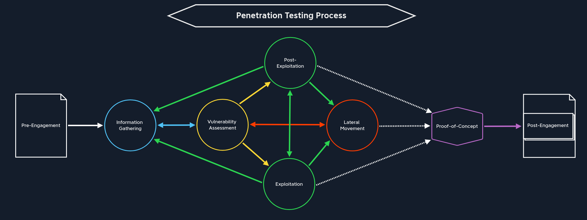

# A. Penetration tester Path Syllabus
- **Introduction**
    - Penetration Testing Process
    - [Getting Started](1_Getting_Started.md)
- **Reconnaissance, Enumeration \& Attack Planning**
    - Network Enumeration with Nmap
    - Footprinting
    - Information Gathering (Web Edition)
    - Vulnerability Assessment
    - File Transfers
    - Shells \& Payloads
    - Using the Metasploit Framework
- **Exploitation \& Lateral Movement**
    - Password Attacks
    - Attacking Common Services
    - Pivoting, Tunneling, and Port Forwarding
    - Active Directory Enumeration \& Attacks
- **Web Exploitation**
    -  Using Web Proxies
    -  Attacking Web Applications with Ffuf
    - Login Brute Forcing
    - SQL Injection Fundamentals
    - SQLMap Essentials
    - Cross-Site Scripting (XSS)
    - File Inclusion
    - File Upload Attacks
    - Command Injections
    - Web Attacks
    - Attacking Common Applications
- **Post-Exploitation**
    - Linux Privilege Escalation
    - Windows Privilege Escalation
- **Reporting \& Capstone**
    - Documentation \& Reporting
    - Attacking Enterprise Networks

---

# B. Penetration Testing Process

1. **Pre-Engagement**
2. **Information Gathering**
    - *Open Source Intelligence (OSINT)*: Finding publicly available information on a target company or individuals that allows the identification of events, external and internal dependencies, and connections.
    - *Infrastructure Enumeration*: Understand how their infrastructure is structured (name servers, mail servers, web servers, cloud instances, etc).
    - *Service Enumeration*: Identify services that allow us to interact with the host or server over the network.
    - *Host Enumeration*: Examine every single host listed in the scoping document, identify which OS is running on the host or server, which services it uses, which versions of the services, etc.
3. **Vulnerability Assessment**
4. **Exploitation**
    - Prioritisation of possible attacks depends on probability of success, complexity, probability of damage.

5. **Post-Exploitation**
    - Evasive Testing
    - Information Gathering
    - Pillaging: Stage where we examine the role of the host in the corportate network (interfaces, routing, DNS, ARP, Services, VPN, IP Subnets, Shares, network traffic, sensitive data)
    - Vulnerability Assessment
    - Privilege Escalation
    - Persistence
    - Data Exfiltration
6. **Lateral Movement**
7. **Proof-of-concept**
8. **Post-Engagement**
    - Cleanup (deleting tools/scripts uploaded to target system, reverting configuration changes)
    - Documentation \& Reporting

---

# C. Testing Methods
- **External Penetration Test:** Performed from an external perspective or as an anonymous user on the internet. Goal is to access external-facing hosts, obtain sensitive data, or gain access to the internal network.
- **Internal Penetration Test:** Perform testing from within the corporate network. Internal pentests may also access isolated systems with no internet access, which usually requires our physical presence at the client's facility.

---

# D. Types of Penetration testing
| Type | Information Provided |
| - | - |
| Blackbox | Minimal. Only the essential information, such as IP addresses and domains, is provided. |
| Greybox | Extended. In this case, we are provided with additional information, such as specific URLs, hostnames, subnets, and similar. |
| Whitebox | Maximum. Here everything is disclosed to us. This gives us an internal view of the entire structure, which allows us to prepare an attack using internal information. We may be given detailed configurations, admin credentials, web application source code, etc. |
| Red-Teaming | May include physical testing and social engineering, among other things. Can be combined with any of the above types. |
| Purple-teaming | It can be combined with any of the above types. However, it focuses on working closely with the defenders. |