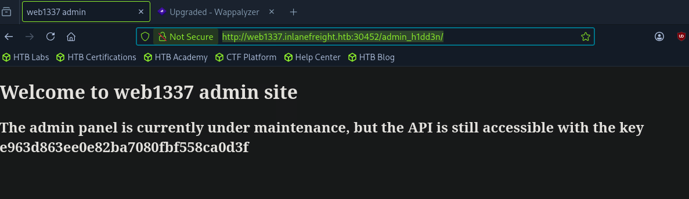

# Table of Contents

- [A. Introduction](#a-introduction)
  - [Active Reconnaissance](#active-reconnaissance)
  - [Passive Reconnaissance](#passive-reconnaissance)
- [B. WHOIS](#b-whois)
  - [Using WHOIS](#using-whois)
- [C. DNS & Subdomains](#c-dns--subdomains)
  - [How DNS works](#how-dns-works)
  - [Hosts File](#hosts-file)
  - [Key DNS Concepts](#key-dns-concepts)
    - [DNS Zones](#dns-zones)
  - [DNS Record Types](#dns-record-types)
  - [DNS Tools](#dns-tools)
  - [Domain Information Groper (DIG)](#domain-information-groper-dig)
  - [Subdomain Enumeration](#subdomain-enumeration)
    - [Active Subdomain Enumeration](#active-subdomain-enumeration)
      - [DNSEnum](#dnsenum)
      - [DNS Zone Transfer](#dns-zone-transfer)
      - [Virtual Hosts](#virtual-hosts)
    - [Passive Subdomain Enumeration](#passive-subdomain-enumeration)
      - [Certificate Transparency Logs](#certificate-transparency-logs)
- [D. Fingerprinting](#d-fingerprinting)
  - [Fingerprinting Tools](#fingerprinting-tools)
  - [Banner Grabbing with Curl](#banner-grabbing-with-curl)
  - [Wafw00f](#wafw00f)
  - [Nikto](#nikto)
- [E. Crawling](#e-crawling)
  - [robots.txt](#robotstxt)
  - [Well-Known URIs](#well-known-uris)
  - [Popular Web Crawlers](#popular-web-crawlers)
    - [Scrapy & Recon Spider](#scrapy--recon-spider)
- [F. Search Engine Discovery](#f-search-engine-discovery)
  - [Search Operators](#search-operators)
  - [Google Dorking](#google-dorking)
- [G. Web Archives](#g-web-archives)
  - [Wayback Machine](#wayback-machine)
- [H. Automating Recon](#h-automating-recon)
  - [Reconnaissance Framework](#reconnaissance-framework)
  - [FinalRecon](#finalrecon)
- [I. Skills Assessment](#i-skills-assessment)

---

# A. Introduction
- Web reconnaissance has 2 fundamental methologies: active and passive.

## Active Reconnaissance
- Attacker directly interacts with the target system to gather information.

| Technique | Description | Example | Tools | Detection Risk |
|---|---|---|---|---|
| **Port Scanning** | Identifying open ports and services running on the target. | Using Nmap to scan a web server for open ports like 80 (HTTP) and 443 (HTTPS). | Nmap, Masscan, Unicornscan | High: Direct interaction with the target can trigger intrusion detection systems (IDS) and firewalls. |
| **Vulnerability Scanning** | Probing the target for known vulnerabilities, such as outdated software or misconfigurations. | Running Nessus against a web application to check for SQL injection flaws or cross-site scripting (XSS) vulnerabilities. | Nessus, OpenVAS, Nikto | High: Vulnerability scanners send exploit payloads that security solutions can detect. |
| **Network Mapping** | Mapping the target's network topology, including connected devices and their relationships. | Using traceroute to determine the path packets take to reach the target server, revealing potential network hops and infrastructure. | Traceroute, Nmap | Medium to High: Excessive or unusual network traffic can raise suspicion. |
| **Banner Grabbing** | Retrieving information from banners displayed by services running on the target. | Connecting to a web server on port 80 and examining the HTTP banner to identify the web server software and version. | Netcat, curl | Low: Banner grabbing typically involves minimal interaction but can still be logged. |
| **OS Fingerprinting** | Identifying the operating system running on the target. | Using Nmap's OS detection capabilities (`-O`) to determine if the target is running Windows, Linux, or another OS. | Nmap, Xprobe2 | Low: OS fingerprinting is usually passive, but some advanced techniques can be detected. |
| **Service Enumeration** | Determining the specific versions of services running on open ports. | Using Nmap's service version detection (`-sV`) to determine if a web server is running Apache 2.4.50 or Nginx 1.18.0. | Nmap | Low: Similar to banner grabbing, service enumeration can be logged but is less likely to trigger alerts. |
| **Web Spidering** | Crawling the target website to identify web pages, directories, and files. | Running a web crawler like Burp Suite Spider or OWASP ZAP Spider to map out the structure of a website and discover hidden resources. | Burp Suite Spider, OWASP ZAP Spider, Scrapy (customisable) | Low to Medium: Can be detected if the crawler's behaviour is not carefully configured to mimic legitimate traffic. |

## Passive Reconnaissance
- Involves gathering information about the target without directly interacting with it.
- Passive reconnaissance is generally considered stealthier and less likely to trigger alarms than active reconnaissance. However, it may yield less comprehensive information, as it relies on what's already publicly accessible.


| Technique | Description | Example | Tools | Risk of Detection |
|---|---|---|---|---|
| **Search Engine Queries** | Utilising search engines to uncover information about the target, including websites, social media profiles, and news articles. | Searching Google for "[Target Name] employees" to find employee information or social media profiles. | Google, DuckDuckGo, Bing, and specialised search engines (e.g., Shodan) | Very Low: Search engine queries are normal internet activity and unlikely to trigger alerts. |
| **WHOIS Lookups** | Querying WHOIS databases to retrieve domain registration details. | Performing a WHOIS lookup on a target domain to find the registrant's name, contact information, and name servers. | whois command-line tool, online WHOIS lookup services | Very Low: WHOIS queries are legitimate and do not raise suspicion. |
| **DNS** | Analysing DNS records to identify subdomains, mail servers, and other infrastructure. | Using `dig` to enumerate subdomains of a target domain. | dig, nslookup, host, dnsenum, fierce, dnsrecon | Very Low: DNS queries are essential for internet browsing and are not typically flagged as suspicious. |
| **Web Archive Analysis** | Examining historical snapshots of the target's website to identify changes, vulnerabilities, or hidden information. | Using the Wayback Machine to view past versions of a target website to see how it has changed over time. | Wayback Machine | Very Low: Accessing archived versions of websites is a normal activity. |
| **Social Media Analysis** | Gathering information from social media platforms like LinkedIn, Twitter, or Facebook. | Searching LinkedIn for employees of a target organisation to learn about their roles, responsibilities, and potential social engineering targets. | LinkedIn, Twitter, Facebook, specialised OSINT tools | Very Low: Accessing public social media profiles is not considered intrusive. |
| **Code Repositories** | Analysing publicly accessible code repositories like GitHub for exposed credentials or vulnerabilities. | Searching GitHub for code snippets or repositories related to the target that might contain sensitive information or code vulnerabilities. | GitHub, GitLab | Very Low: Code repositories are meant for public access, and searching them is not suspicious. |

--- 

# B. WHOIS
- `WHOIS` is a widely used query and response protocol designed to access databases that store information about registered internet resources. 
- Primarily associated with domain names, `WHOIS` can also provide details about IP address blocks and autonomous systems.

```bash
selwynang@htb[/htb]$ whois inlanefreight.com

[...]
Domain Name: inlanefreight.com
Registry Domain ID: 2420436757_DOMAIN_COM-VRSN
Registrar WHOIS Server: whois.registrar.amazon
Registrar URL: https://registrar.amazon.com
Updated Date: 2023-07-03T01:11:15Z
Creation Date: 2019-08-05T22:43:09Z
[...]
```

- Each `WHOIS` record typically contaisn the following information:
    - *Domain Name*: The domain name itself (e.g., example.com)
    - Registrar: The company where the domain was registered (e.g., GoDaddy, Namecheap)
    - *Registrant Contact*: The person or organization that registered the domain.
    - *Administrative Contact*: The person responsible for managing the domain.
    - *Technical Contact*: The person handling technical issues related to the domain.
    - *Creation and Expiration Dates*: When the domain was registered and when it's set to expire.
    - *Name Servers*: Servers that translate the domain name into an IP address.

## Using WHOIS
```bash
selwynang@htb[/htb]$ sudo apt update
selwynang@htb[/htb]$ sudo apt install whois -y
selwynang@htb[/htb]$ whois facebook.com

   Domain Name: FACEBOOK.COM
   Registry Domain ID: 2320948_DOMAIN_COM-VRSN
   Registrar WHOIS Server: whois.registrarsafe.com
   Registrar URL: http://www.registrarsafe.com
   Updated Date: 2024-04-24T19:06:12Z
   Creation Date: 1997-03-29T05:00:00Z
   Registry Expiry Date: 2033-03-30T04:00:00Z
   Registrar: RegistrarSafe, LLC
   Registrar IANA ID: 3237
   Registrar Abuse Contact Email: abusecomplaints@registrarsafe.com
   Registrar Abuse Contact Phone: +1-650-308-7004
   Domain Status: clientDeleteProhibited https://icann.org/epp#clientDeleteProhibited
   Domain Status: clientTransferProhibited https://icann.org/epp#clientTransferProhibited
   Domain Status: clientUpdateProhibited https://icann.org/epp#clientUpdateProhibited
   Domain Status: serverDeleteProhibited https://icann.org/epp#serverDeleteProhibited
   Domain Status: serverTransferProhibited https://icann.org/epp#serverTransferProhibited
   Domain Status: serverUpdateProhibited https://icann.org/epp#serverUpdateProhibited
   Name Server: A.NS.FACEBOOK.COM
   Name Server: B.NS.FACEBOOK.COM
   Name Server: C.NS.FACEBOOK.COM
   Name Server: D.NS.FACEBOOK.COM
   DNSSEC: unsigned
   URL of the ICANN Whois Inaccuracy Complaint Form: https://www.icann.org/wicf/
>>> Last update of whois database: 2024-06-01T11:24:10Z <<<

[...]
Registry Registrant ID:
Registrant Name: Domain Admin
Registrant Organization: Meta Platforms, Inc.
[...]
```
- Domain Status: `clientDeleteProhibited`, `clientTransferProhibited`, `clientUpdateProhibited`, `serverDeleteProhibited`, `serverTransferProhibited`, and `serverUpdateProhibited` indicate that the domain is protected against unauthorized changes, transfers, or deletions on both the client and server sides. This highlights a strong emphasis on security and control over the domain.
- Name servers are all within `facebook.com` domain, suggesting that Meta Platforms manages its DNS infrastructure. 

---

# C. DNS \& Subdomains
## How DNS works
1. **DNS Query:** When we enter the domain name, our computer first checks its cache to see if it remembers the IP address from a previous visit. If not, it reaches out to a DNS resolver, usually provided by the ISP.
2. **Recursive Lookup:** The resolver also has a cache, and if it does not find the IP address there, it traverses up the DNS hierarchy. 
    - It begins by asking the a root name server. 
    - The root server does not know the exact address but knows that the top-level domain (TLD) name server does. TLD is responsible for the domain's ending (eg. `.com`, `.org`). It points the resolver there.
    - TLD sends the resolver to the specific authoritative name server which is responsible for the specific domain we are looking for (eg. `example.com`).
    - Authoritative name server holds the correct IP address and sends it back to the resolver.
3. **DNS resolver returns information:** The resolver receives the IP address and gives it to the computer, which remembers it for a while (caching).

## Hosts File
- `hosts` file is a simple text file used to map hostnames to IP addresses, providing a manual method of domain name resolution that bypasses the DNS process. 
- While DNS automates the translation of domain names to IP addresses, the hosts file allows for direct, local overrides.
- `hosts` file is located in in `C:\Windows\System32\drivers\etc\hosts` on Windows and in `/etc/hosts` on Linux and MacOS.

```bash
# Format: <IP Address>    <Hostname> [<Alias> ...]

127.0.0.1       localhost
192.168.1.10    devserver.local
```

## Key DNS Concepts

### DNS Zones
- A zone is a distinct part of the domain namespace that a specific entity or administrator manages.  
- For example, `example.com` and all its subdomains (like `mail.example.com` or `blog.example.com`) would typically belong to the same DNS zone.
- The zone file, a text file residing on a DNS server, defines the resource records within this zone, providing crucial information for translating domain names into IP addresses.

```bash
$TTL 3600 ; Default Time-To-Live (1 hour)
@       IN SOA   ns1.example.com. admin.example.com. (
                2024060401 ; Serial number (YYYYMMDDNN)
                3600       ; Refresh interval
                900        ; Retry interval
                604800     ; Expire time
                86400 )    ; Minimum TTL

@       IN NS    ns1.example.com.
@       IN NS    ns2.example.com.
@       IN MX 10 mail.example.com.
www     IN A     192.0.2.1
mail    IN A     198.51.100.1
ftp     IN CNAME www.example.com.
```

## DNS Record Types
| Record Type | Full Name | Description | Zone File Example |
|---|---|---|---|
| `A` | Address Record | Maps a hostname to its IPv4 address. | `www.example.com.` IN A `192.0.2.1` |
| `AAAA` | IPv6 Address Record | Maps a hostname to its IPv6 address. | `www.example.com.` IN AAAA `2001:db8:85a3::8a2e:370:7334` |
| `CNAME` | Canonical Name Record | Creates an alias for a hostname, pointing it to another hostname. | `blog.example.com.` IN CNAME `webserver.example.net.` |
| `MX` | Mail Exchange Record | Specifies the mail server(s) responsible for handling email for the domain. | `example.com.` IN MX 10 `mail.example.com.` |
| `NS` | Name Server Record | Delegates a DNS zone to a specific authoritative name server. | `example.com.` IN NS `ns1.example.com.` |
| `TXT` | Text Record | Stores arbitrary text information, often used for domain verification or security policies. | `example.com.` IN TXT `"v=spf1 mx -all"` (SPF record) |
| `SOA` | Start of Authority Record | Specifies administrative information about a DNS zone, including the primary name server, responsible person's email, and other parameters. | `example.com.` IN SOA `ns1.example.com. admin.example.com. 2024060301 10800 3600 604800 86400` |
| `SRV` | Service Record | Defines the hostname and port number for specific services. | `_sip._udp.example.com.` IN SRV 10 5 5060 `sipserver.example.com.` |
| `PTR` | Pointer Record | Used for reverse DNS lookups, mapping an IP address to a hostname. | `1.2.0.192.in-addr.arpa.` IN PTR `www.example.com.` |

## DNS Tools
| Tool | Key Features | Use Cases |
|---|---|---|
| `dig` | Versatile DNS lookup tool that supports various query types (A, MX, NS, TXT, etc.) and detailed output. | Manual DNS queries, zone transfers (if allowed), troubleshooting DNS issues, and in-depth analysis of DNS records. |
| `nslookup` | Simpler DNS lookup tool, primarily for A, AAAA, and MX records. | Basic DNS queries, quick checks of domain resolution and mail server records. |
| `host` | Streamlined DNS lookup tool with concise output. | Quick checks of A, AAAA, and MX records. |
| `dnsenum` | Automated DNS enumeration tool, dictionary attacks, brute-forcing, zone transfers (if allowed). | Discovering subdomains and gathering DNS information efficiently. |
| `fierce` | DNS reconnaissance and subdomain enumeration tool with recursive search and wildcard detection. | User-friendly interface for DNS reconnaissance, identifying subdomains and potential targets. |
| `dnsrecon` | Combines multiple DNS reconnaissance techniques and supports various output formats. | Comprehensive DNS enumeration, identifying subdomains, and gathering DNS records for further analysis. |
| `theHarvester` | OSINT tool that gathers information from various sources, including DNS records (email addresses). | Collecting email addresses, employee information, and other data associated with a domain from multiple sources. |
| `Online DNS Lookup Services` | User-friendly interfaces for performing DNS lookups. | Quick and easy DNS lookups, convenient when command-line tools are not available, checking for domain availability or basic information |

## Domain Information Groper (DIG)

| Command | Description |
|---|---|
| `dig domain.com` | Performs a default A record lookup for the domain. |
| `dig domain.com A` | Retrieves the IPv4 address (A record) associated with the domain. |
| `dig domain.com AAAA` | Retrieves the IPv6 address (AAAA record) associated with the domain. |
| `dig domain.com MX` | Finds the mail servers (MX records) responsible for the domain. |
| `dig domain.com NS` | Identifies the authoritative name servers for the domain. |
| `dig domain.com TXT` | Retrieves any TXT records associated with the domain. |
| `dig domain.com CNAME` | Retrieves the canonical name (CNAME) record for the domain. |
| `dig domain.com SOA` | Retrieves the start of authority (SOA) record for the domain. |
| `dig @1.1.1.1 domain.com` | Specifies a specific name server to query; in this case 1.1.1.1 |
| `dig +trace domain.com` | Shows the full path of DNS resolution. |
| `dig -x 192.168.1.1` | Performs a reverse lookup on the IP address 192.168.1.1 to find the associated host name. You may need to specify a name server. |
| `dig +short domain.com` | Provides a short, concise answer to the query. |
| `dig +noall +answer domain.com` | Displays only the answer section of the query output. |
| `dig domain.com ANY` | Retrieves all available DNS records for the domain (Note: Many DNS servers ignore `ANY` queries to reduce load and prevent abuse, as per [RFC 8482](https://www.rfc-editor.org/rfc/rfc8482)). |

```bash
selwynang@htb[/htb]$ dig google.com

; <<>> DiG 9.18.24-0ubuntu0.22.04.1-Ubuntu <<>> google.com
;; global options: +cmd
;; Got answer:
;; ->>HEADER<<- opcode: QUERY, status: NOERROR, id: 16449
;; flags: qr rd ad; QUERY: 1, ANSWER: 1, AUTHORITY: 0, ADDITIONAL: 0
;; WARNING: recursion requested but not available


;; QUESTION SECTION:
;google.com.                    IN      A

;; ANSWER SECTION:
google.com.             0       IN      A       142.251.47.142

;; Query time: 0 msec
;; SERVER: 172.23.176.1#53(172.23.176.1) (UDP)
;; WHEN: Thu Jun 13 10:45:58 SAST 2024
;; MSG SIZE  rcvd: 54
```

## Subdomain Enumeration
- Subdomains are extensions of the main domain, often created to organise and separate different sections or functionalities of a website.
- Subdomain Enumeration aims to identify and list these subdomains. From DNS perspective, subdomains are typically represented by `A` or `AAAA` records, which map the subdomain name to its corresponding IP address.

### Active Subdomain Enumeration
- DNS Zone Transfer (interacting with the target domain's DNS servers to uncover subdomains)
- Brute-force Enumeration (`dnsenum`, `fluff`, `gobuster`, `fierce`, `dnsrecon`, `amass`, `assetfinder`, `puredns`)
    - Consists of 4 stages:
        1. Worlist Selection
        2. Iteration and Querying
        3. DNS Lookup
        4. Filtering and Validation

#### DNSEnum
```bash
dnsenum --enum inlanefreight.com -f /usr/share/seclists/Discovery/DNS/subdomains-top1million-20000.txt -r

# --enum: Specifies that we want to enumerate subdomains
# --f: Path to the wordlist we will use for brute-forcing
# -r: Enables recursive subdomain brute-forcing.
```

#### DNS Zone Transfer
- DNS zone transfer is essentially a wholesale copy of all DNS records within a zone (a domain and its subdomains) from one name server to another. This process is essential for maintaining consistency and redundancy across DNS servers.
-  However, if not adequately secured, unauthorised parties can download the entire zone file, revealing a complete list of subdomains, their associated IP addresses, and other sensitive DNS data.
- Modern DNS servers are typically configured to allow zone transfers only to trusted secondary servers, ensuring that sensitive zone data remains confidential.
- However, misconfigurations can still occur due to human error or outdated practices. This is why attempting a zone transfer (with proper authorisation) remains a valuable reconnaissance technique.

```bash
dig axfr @nsztm1.digi.ninja zonetransfer.me
```

#### Virtual Hosts
- Virtual hosting is the ability of web servers to distinguish between multiple websites or applications sharing the same IP address. Acheived by leveraging the HTTP Host header, a piece of information included in every HTTP request sent by a browser.
- `VHost fuzzing` is a technique to discover public and non-public subdomains and VHosts by testing various hostnames against a known IP address.
- Several tools can be used to uncover potential virtual hosts: `gobuster`, `Fereoxbuster`, `ffuf`.
- Very important to add virtual hosts' domain name to `/etc/hosts` file along with the IP address to ensure proper mapping (Eg. `10.129.42.195 app.inlanefreight.local dev.inlanefreight.local`)

```bash
gobuster vhost -u http://<target_IP_address> -w <wordlist_file> --append-domain

# -u:  specifies the target URL
# -w: specifies the wordlist file
# --append-domain: appends the base domain to each word in the wordlist
```

### Passive Subdomain Enumeration
- Relies on external sources of information to discover subdomains without directly querying the target's DNS servers.
- One valuable resource is Certificate Transparency (CT) logs, public repositories of SSL/TLS certificates. These certificates often include a list of associated subdomains in their Subject Alternative Name (SAN) field, providing a treasure trove of potential targets.
- Search engines like Google or DuckDuckGo employ search operators (eg. `site:`) to filter results to show only subdomains related to the target domain.

#### Certificate Transparency Logs
- Certificate Transparency (CT) logs are public, append-only ledgers that record the issuance of SSL/TLS certificates. Whenever a Certificate Authority (CA) issues a new certificate, it must submit it to multiple CT logs.
- Unlike brute-forcing or wordlist-based approaches, which rely on guessing or predicting subdomain names, CT logs provide a definitive record of certificates issued for a domain and its subdomains. This means you're not limited by the scope of your wordlist or the effectiveness of your brute-forcing algorithm. Instead, you gain access to a historical and comprehensive view of a domain's subdomains, including those that might not be actively used or easily guessable.
- CT logs can unveil subdomains associated with old or expired certificates. These subdomains might host outdated software or configurations, making them potentially vulnerable to exploitation.
- 2 popular options for searching CT Logs: `crt.sh`, `Censys`.
```bash
selwynang@htb[/htb]$ curl -s "https://crt.sh/?q=facebook.com&output=json" | jq -r '.[]
 | select(.name_value | contains("dev")) | .name_value' | sort -u
 
*.dev.facebook.com
*.newdev.facebook.com
*.secure.dev.facebook.com
dev.facebook.com
devvm1958.ftw3.facebook.com
facebook-amex-dev.facebook.com
facebook-amex-sign-enc-dev.facebook.com
newdev.facebook.com
secure.dev.facebook.com

# curl -s "https://crt.sh/?q=facebook.com&output=json": This command fetches the JSON output from crt.sh for certificates matching the domain facebook.com.
# jq -r '.[] | select(.name_value | contains("dev")) | .name_value': This part filters the JSON results, selecting only entries where the name_value field (which contains the domain or subdomain) includes the string "dev". The -r flag tells jq to output raw strings.
# sort -u: This sorts the results alphabetically and removes duplicates.
```

# D. Fingerprinting
- Fingerprinting focuses on extracting technical details about the technologies powering a website or web application.
- **Fingerprinting Techniques**
    - `Banner Grabbing`: Analysing the banners presented by web servers and other services. These banners often reveal the server software, version numbers, and other details.
    - `Analysing HTTP Headers`: The Server header typically discloses the web server software, while the X-Powered-By header might reveal additional technologies like scripting languages or frameworks.
    - `Probing for specific responses`: Sending specially crafted requests to the target can elicit unique responses that reveal specific technologies or versions.
    - `Analysing page content`: A web page's content, including its structure, scripts, and other elements, can often provide clues about the underlying technologies.

## Fingerprinting Tools
| Tool | Description | Features |
|---|---|---|
| `Wappalyzer` | Browser extension and online service for website technology profiling. | Identifies a wide range of web technologies, including CMSs, frameworks, analytics tools, and more. |
| `BuiltWith` | Web technology profiler that provides detailed reports on a website's technology stack. | Offers both free and paid plans with varying levels of detail. |
| `WhatWeb` | Command-line tool for website fingerprinting. | Uses a vast database of signatures to identify various web technologies. |
| `Nmap` | Versatile network scanner that can be used for various reconnaissance tasks, including service and OS fingerprinting. | Can be used with scripts (NSE) to perform more specialised fingerprinting. |
| `Netcraft` | Offers a range of web security services, including website fingerprinting and security reporting. | Provides detailed reports on a website's technology, hosting provider, and security posture. |
| `wafw00f` | Command-line tool specifically designed for identifying Web Application Firewalls (WAFs). | Helps determine if a WAF is present and, if so, its type and configuration. |

## Banner Grabbing with Curl
```bash
selwynang@htb[/htb]$ curl -I inlanefreight.com

HTTP/1.1 301 Moved Permanently
Date: Fri, 31 May 2024 12:07:44 GMT
Server: Apache/2.4.41 (Ubuntu)
Location: https://inlanefreight.com/
Content-Type: text/html; charset=iso-8859-1

# -I: To fetch only the HTTP headers, not the entire page content
```

## Wafw00f
- Web Application Firewalls (WAFs) are security solutions designed to protect web applications from various attacks.
- To detect the presence of a WAF, we will use the `wafw00f` tool.

```bash
selwynang@htb[/htb]$ pip3 install git+https://github.com/EnableSecurity/wafw00f

selwynang@htb[/htb]$ wafw00f inlanefreight.com

                ______
               /      \
              (  W00f! )
               \  ____/
               ,,    __            404 Hack Not Found
           |`-.__   / /                      __     __
           /"  _/  /_/                       \ \   / /
          *===*    /                          \ \_/ /  405 Not Allowed
         /     )__//                           \   /
    /|  /     /---`                        403 Forbidden
    \\/`   \ |                                 / _ \
    `\    /_\\_              502 Bad Gateway  / / \ \  500 Internal Error
      `_____``-`                             /_/   \_\

                        ~ WAFW00F : v2.2.0 ~
        The Web Application Firewall Fingerprinting Toolkit
    
[*] Checking https://inlanefreight.com
[+] The site https://inlanefreight.com is behind Wordfence (Defiant) WAF.
[~] Number of requests: 2
```

## Nikto
- `Nikto` is a powerful open-source web server scanner. In addition to its primary function as a vulnerability assessment tool, `Nikto`'s fingerprinting capabilities provide insights into a website's technology stack.

```bash
selwynang@htb[/htb]$ sudo apt update && sudo apt install -y perl
selwynang@htb[/htb]$ git clone https://github.com/sullo/nikto
selwynang@htb[/htb]$ cd nikto/program
selwynang@htb[/htb]$ chmod +x ./nikto.pl

selwynang@htb[/htb]$ nikto -h inlanefreight.com -Tuning b

# -h: specifies target host
# -Tuning b: Tells Nikto to only run the software identification modules

- Nikto v2.5.0
---------------------------------------------------------------------------
+ Multiple IPs found: 134.209.24.248, 2a03:b0c0:1:e0::32c:b001
+ Target IP:          134.209.24.248
+ Target Hostname:    www.inlanefreight.com
+ Target Port:        443
---------------------------------------------------------------------------
+ SSL Info:        Subject:  /CN=inlanefreight.com
                   Altnames: inlanefreight.com, www.inlanefreight.com
                   Ciphers:  TLS_AES_256_GCM_SHA384
                   Issuer:   /C=US/O=Let's Encrypt/CN=R3
+ Start Time:         2024-05-31 13:35:54 (GMT0)
---------------------------------------------------------------------------
+ Server: Apache/2.4.41 (Ubuntu)
+ /: Link header found with value: ARRAY(0x558e78790248). See: https://developer.mozilla.org/en-US/docs/Web/HTTP/Headers/Link
+ /: The site uses TLS and the Strict-Transport-Security HTTP header is not defined. See: https://developer.mozilla.org/en-US/docs/Web/HTTP/Headers/Strict-Transport-Security
+ /: The X-Content-Type-Options header is not set. This could allow the user agent to render the content of the site in a different fashion to the MIME type. See: https://www.netsparker.com/web-vulnerability-scanner/vulnerabilities/missing-content-type-header/
+ /index.php?: Uncommon header 'x-redirect-by' found, with contents: WordPress.
+ No CGI Directories found (use '-C all' to force check all possible dirs)
+ /: The Content-Encoding header is set to "deflate" which may mean that the server is vulnerable to the BREACH attack. See: http://breachattack.com/
+ Apache/2.4.41 appears to be outdated (current is at least 2.4.59). Apache 2.2.34 is the EOL for the 2.x branch.
+ /: Web Server returns a valid response with junk HTTP methods which may cause false positives.
+ /license.txt: License file found may identify site software.
+ /: A Wordpress installation was found.
+ /wp-login.php?action=register: Cookie wordpress_test_cookie created without the httponly flag. See: https://developer.mozilla.org/en-US/docs/Web/HTTP/Cookies
+ /wp-login.php:X-Frame-Options header is deprecated and has been replaced with the Content-Security-Policy HTTP header with the frame-ancestors directive instead. See: https://developer.mozilla.org/en-US/docs/Web/HTTP/Headers/X-Frame-Options
+ /wp-login.php: Wordpress login found.
+ 1316 requests: 0 error(s) and 12 item(s) reported on remote host
+ End Time:           2024-05-31 13:47:27 (GMT0) (693 seconds)
---------------------------------------------------------------------------
+ 1 host(s) tested

```

# E. Crawling
- Crawling, often called spidering, the automated process of systematically browsing the World Wide Web.
- A web crawler starts with a seed URL, which is the initial web page to crawl, then the crawler fetches the page, parses its content, and extracta all its links. It then adds these links to a queue and crawls them, repeating the process iteratively.
- Crawlers can extract:
    - Links (internal and external)
    - Comments
    - Metadata
    - Sensitive Files (backup files like `.bak`, `.old`, configuration files like `web.config`, `settings.php`, log files like `error_log`, `access_log`, files containing passwords, API keys, etc.)

## robots.txt
- `robots.txt` is a simple text file placed in the root directory of a website. It adheres to the Robots Exclusion Standard, guidelines for how web crawlers should behave when visiting a website. This file contains instructions in the form of "directives" that tell bots which parts of the website they can and cannot crawl.

```bash
User-agent: *
Disallow: /private/

# Tells all user agents via wildcard notation that they are not allowed to access any URLs that start with /private/
```
- **User-agent**: specifies which crawler or bot the following rules apply to. A wildcard (*) indicates that the rules apply to all bots. Specific user agents can also be targeted, such as "Googlebot" (Google's crawler) or "Bingbot" (Microsoft's crawler).
- **Directives**: provide specific instructions to the identified user-agent.

| Directive | Description | Example |
|---|---|---|
| `Disallow` | Specifies paths or patterns that the bot should not crawl. | `Disallow: /admin/` (disallow access to the admin directory) |
| `Allow` | Explicitly permits the bot to crawl specific paths or patterns, even if they fall under a broader `Disallow` rule. | `Allow: /public/` (allow access to the public directory) |
| `Crawl-delay` | Sets a delay (in seconds) between successive requests from the bot to avoid overloading the server. | `Crawl-delay: 10` (10-second delay between requests) |
| `Sitemap` | Provides the URL to an XML sitemap for more efficient crawling. | `Sitemap: https://www.example.com/sitemap.xml` |

## Well-Known URIs
- `.well-known` serves as a standardized directory within a website's root domain. This designated location, typically accessible via the `/.well-known/` path on a web server, centralizes a website's critical metadata, including configuration files and information related to its services, protocols, and security mechanisms.
- Eg. `https://example.com/.well-known/security.txt`

| URI Suffix | Description |
|---|---|
| `security.txt` | Contains contact information for security researchers to report vulnerabilities. |
| `/.well-known/change-password` | Provides a standard URL for directing users to a password change page. |
| `openid-configuration` | Defines configuration details for OpenID Connect, an identity layer on top of the OAuth 2.0 protocol. |
| `assetlinks.json` | Used for verifying ownership of digital assets (e.g., apps) associated with a domain. |
| `mta-sts.txt` | Specifies the policy for SMTP MTA Strict Transport Security (MTA-STS) to enhance email security. |

- Eg. `https://example.com/.well-known/openid-configuration` returns a JSON document containing metadata about the provider's endpoints, supported authentication methods, token issuance, and more: 

```json
{
  "issuer": "https://example.com",
  "authorization_endpoint": "https://example.com/oauth2/authorize",
  "token_endpoint": "https://example.com/oauth2/token",
  "userinfo_endpoint": "https://example.com/oauth2/userinfo",
  "jwks_uri": "https://example.com/oauth2/jwks",
  "response_types_supported": ["code", "token", "id_token"],
  "subject_types_supported": ["public"],
  "id_token_signing_alg_values_supported": ["RS256"],
  "scopes_supported": ["openid", "profile", "email"]
}
```
- The information obtained from the openid-configuration endpoint provides multiple exploration opportunities:
    - **Endpoint Discovery**:
        - **Authorization Endpoint**: Identifying the URL for user authorization requests.
        - **Token Endpoint**: Finding the URL where tokens are issued.
        - **Userinfo Endpoint**: Locating the endpoint that provides user information.
    - **JWKS URI**: The jwks_uri reveals the JSON Web Key Set (JWKS), detailing the cryptographic keys used by the server.
    - **Supported Scopes and Response Types**: Understanding which scopes and response types are supported helps in mapping out the functionality and limitations of the OpenID Connect implementation.
    - **Algorithm Details**: Information about supported signing algorithms can be crucial for understanding the security measures in place.

## Popular Web Crawlers
- `Burp Suite Spider`
- `OWASP ZAP (Zed Attack Proxy)`
- `Scrapy (Python Framework)`
- `Apache Nutch (Scalable Crawler)`

### Scrapy & Recon Spider
- `scrapy` is a versatile and scalable Python framework for building custom web crawlers. It provides rich features for extracting structured data from websites, handling complex crawling scenarios, and automating data processing. Its flexibility makes it ideal for tailored reconnaissance tasks.
- `ReconSpider` is a custom scrapy spider.

```bash
selwynang@htb[/htb]$ pip3 install scrapy

selwynang@htb[/htb]$ wget -O ReconSpider.zip https://academy.hackthebox.com/storage/modules/144/ReconSpider.v1.2.zip
selwynang@htb[/htb]$ unzip ReconSpider.zip 

selwynang@htb[/htb]$ python3 ReconSpider.py http://inlanefreight.com

```
- After running `ReconSpider.py`, the data will be saved in `results.json`:
```json
{
    "emails": [
        "lily.floid@inlanefreight.com",
        "cvs@inlanefreight.com",
        ...
    ],
    "links": [
        "https://www.themeansar.com",
        "https://www.inlanefreight.com/index.php/offices/",
        ...
    ],
    "external_files": [
        "https://www.inlanefreight.com/wp-content/uploads/2020/09/goals.pdf",
        ...
    ],
    "js_files": [
        "https://www.inlanefreight.com/wp-includes/js/jquery/jquery-migrate.min.js?ver=3.3.2",
        ...
    ],
    "form_fields": [],
    "images": [
        "https://www.inlanefreight.com/wp-content/uploads/2021/03/AboutUs_01-1024x810.png",
        ...
    ],
    "videos": [],
    "audio": [],
    "comments": [
        "<!-- #masthead -->",
        ...
    ]
}

```

# F. Search Engine Discovery

## Search Operators
| Operator | Operator Description | Example | Example Description |
|---|---|---|---|
| `site:` | Limits results to a specific website or domain. | `site:example.com` | Find all publicly accessible pages on example.com. |
| `inurl:` | Finds pages with a specific term in the URL. | `inurl:login` | Search for login pages on any website. |
| `filetype:` | Searches for files of a particular type. | `filetype:pdf` | Find downloadable PDF documents. |
| `intitle:` | Finds pages with a specific term in the title. | `intitle:"confidential report"` | Look for documents titled "confidential report" or similar variations. |
| `intext:` or `inbody:` | Searches for a term within the body text of pages. | `intext:"password reset"` | Identify webpages containing the term "password reset". |
| `cache:` | Displays the cached version of a webpage (if available). | `cache:example.com` | View the cached version of example.com to see its previous content. |
| `link:` | Finds pages that link to a specific webpage. | `link:example.com` | Identify websites linking to example.com. |
| `related:` | Finds websites related to a specific webpage. | `related:example.com` | Discover websites similar to example.com. |
| `info:` | Provides a summary of information about a webpage. | `info:example.com` | Get basic details about example.com, such as its title and description. |
| `define:` | Provides definitions of a word or phrase. | `define:phishing` | Get a definition of "phishing" from various sources. |
| `numrange:` | Searches for numbers within a specific range. | `site:example.com numrange:1000-2000` | Find pages on example.com containing numbers between 1000 and 2000. |
| `allintext:` | Finds pages containing all specified words in the body text. | `allintext:admin password reset` | Search for pages containing both "admin" and "password reset" in the body text. |
| `allinurl:` | Finds pages containing all specified words in the URL. | `allinurl:admin panel` | Look for pages with "admin" and "panel" in the URL. |
| `allintitle:` | Finds pages containing all specified words in the title. | `allintitle:confidential report 2023` | Search for pages with "confidential," "report," and "2023" in the title. |
| `AND` | Narrows results by requiring all terms to be present. | `site:example.com AND (inurl:admin OR inurl:login)` | Find admin or login pages specifically on example.com. |
| `OR` | Broadens results by including pages with any of the terms. | `"linux" OR "ubuntu" OR "debian"` | Search for webpages mentioning Linux, Ubuntu, or Debian. |
| `NOT` | Excludes results containing the specified term. | `site:bank.com NOT inurl:login` | Find pages on bank.com excluding login pages. |
| `*` (wildcard) | Represents any character or word. | `site:socialnetwork.com filetype:pdf user* manual` | Search for user manuals (user guide, user handbook) in PDF format on socialnetwork.com. |
| `..` (range search) | Finds results within a specified numerical range. | `site:ecommerce.com "price" 100..500` | Look for products priced between 100 and 500 on an e-commerce website. |
| `" "` (quotation marks) | Searches for exact phrases. | `"information security policy"` | Find documents mentioning the exact phrase "information security policy". |
| `-` (minus sign) | Excludes terms from search results. | `site:news.com -inurl:sports` | Search for news articles on news.com excluding sports-related content. |

## Google Dorking
- Also known as Google Hacking, is a technique that leverages the power of search operators to uncover sensitive information, security vulnerabilities, or hidden content on websites, using Google Search.
- **Finding Login Pages:**
  - `site:example.com inurl:login`
  - `site:example.com (inurl:login OR inurl:admin)`

- **Identifying Exposed Files:**
  - `site:example.com filetype:pdf`
  - `site:example.com (filetype:xls OR filetype:docx)`

- **Uncovering Configuration Files:**
  - `site:example.com inurl:config.php`
  - `site:example.com (ext:conf OR ext:cnf)` (searches for extensions commonly used for configuration files)

- **Locating Database Backups:**
  - `site:example.com inurl:backup`
  - `site:example.com filetype:sql`

# G. Web Archives

## Wayback Machine
- Wayback Machine operates by using web crawlers to capture snapshots of websites at regular intervals automatically. 
- These crawlers navigate through the web, following links and indexing pages, much like how search engine crawlers work. 
- However, instead of simply indexing the information for search purposes, the Wayback Machine stores the entire content of the pages, including HTML, CSS, JavaScript, images, and other resources.

# H. Automating Recon

## Reconnaissance Framework
- **FinalRecon**: A Python-based reconnaissance tool offering a range of modules for different tasks like SSL certificate checking, Whois information gathering, header analysis, and crawling. Its modular structure enables easy customisation for specific needs.
- **Recon-ng**: A powerful framework written in Python that offers a modular structure with various modules for different reconnaissance tasks. It can perform DNS enumeration, subdomain discovery, port scanning, web crawling, and even exploit known vulnerabilities.
- **theHarvester**: Specifically designed for gathering email addresses, subdomains, hosts, employee names, open ports, and banners from different public sources like search engines, PGP key servers, and the SHODAN database. It is a command-line tool written in Python.
- **SpiderFoot*: An open-source intelligence automation tool that integrates with various data sources to collect information about a target, including IP addresses, domain names, email addresses, and social media profiles. It can perform DNS lookups, web crawling, port scanning, and more.
- **OSINT Framework**: A collection of various tools and resources for open-source intelligence gathering. It covers a wide range of information sources, including social media, search engines, public records, and more.

## FinalRecon
- Provides recon information such as:
    - Header Information
    - `whois` lookup
    - SSL certificate information
    - Crawler
    - DNS Enumeration
    - Subdomain Enumeration
    - Directory Enumeration
    - Wayback Machine

```bash
selwynang@htb[/htb]$ git clone https://github.com/thewhiteh4t/FinalRecon.git
selwynang@htb[/htb]$ cd FinalRecon
selwynang@htb[/htb]$ pip3 install -r requirements.txt
selwynang@htb[/htb]$ chmod +x ./finalrecon.py
selwynang@htb[/htb]$ ./finalrecon.py --help

usage: finalrecon.py [-h] [--url URL] [--headers] [--sslinfo] [--whois]
                     [--crawl] [--dns] [--sub] [--dir] [--wayback] [--ps]
                     [--full] [-nb] [-dt DT] [-pt PT] [-T T] [-w W] [-r] [-s]
                     [-sp SP] [-d D] [-e E] [-o O] [-cd CD] [-k K]

FinalRecon - All in One Web Recon | v1.1.6

optional arguments:
  -h, --help  show this help message and exit
  --url URL   Target URL
  --headers   Header Information
  --sslinfo   SSL Certificate Information
  --whois     Whois Lookup
  --crawl     Crawl Target
  --dns       DNS Enumeration
  --sub       Sub-Domain Enumeration
  --dir       Directory Search
  --wayback   Wayback URLs
  --ps        Fast Port Scan
  --full      Full Recon

Extra Options:
  -nb         Hide Banner
  -dt DT      Number of threads for directory enum [ Default : 30 ]
  -pt PT      Number of threads for port scan [ Default : 50 ]
  -T T        Request Timeout [ Default : 30.0 ]
  -w W        Path to Wordlist [ Default : wordlists/dirb_common.txt ]
  -r          Allow Redirect [ Default : False ]
  -s          Toggle SSL Verification [ Default : True ]
  -sp SP      Specify SSL Port [ Default : 443 ]
  -d D        Custom DNS Servers [ Default : 1.1.1.1 ]
  -e E        File Extensions [ Example : txt, xml, php ]
  -o O        Export Format [ Default : txt ]
  -cd CD      Change export directory [ Default : ~/.local/share/finalrecon ]
  -k K        Add API key [ Example : shodan@key ]

```

```bash
selwynang@htb[/htb]$ ./finalrecon.py --headers --whois --url http://inlanefreight.com

 ______  __   __   __   ______   __
/\  ___\/\ \ /\ "-.\ \ /\  __ \ /\ \
\ \  __\\ \ \\ \ \-.  \\ \  __ \\ \ \____
 \ \_\   \ \_\\ \_\\"\_\\ \_\ \_\\ \_____\
  \/_/    \/_/ \/_/ \/_/ \/_/\/_/ \/_____/
 ______   ______   ______   ______   __   __
/\  == \ /\  ___\ /\  ___\ /\  __ \ /\ "-.\ \
\ \  __< \ \  __\ \ \ \____\ \ \/\ \\ \ \-.  \
 \ \_\ \_\\ \_____\\ \_____\\ \_____\\ \_\\"\_\
  \/_/ /_/ \/_____/ \/_____/ \/_____/ \/_/ \/_/

[>] Created By   : thewhiteh4t
 |---> Twitter   : https://twitter.com/thewhiteh4t
 |---> Community : https://twc1rcle.com/
[>] Version      : 1.1.6

[+] Target : http://inlanefreight.com

[+] IP Address : 134.209.24.248

[!] Headers :

Date : Tue, 11 Jun 2024 10:08:00 GMT
Server : Apache/2.4.41 (Ubuntu)
Link : <https://www.inlanefreight.com/index.php/wp-json/>; rel="https://api.w.org/", <https://www.inlanefreight.com/index.php/wp-json/wp/v2/pages/7>; rel="alternate"; type="application/json", <https://www.inlanefreight.com/>; rel=shortlink
Vary : Accept-Encoding
Content-Encoding : gzip
Content-Length : 5483
Keep-Alive : timeout=5, max=100
Connection : Keep-Alive
Content-Type : text/html; charset=UTF-8

[!] Whois Lookup : 

   Domain Name: INLANEFREIGHT.COM
   Registry Domain ID: 2420436757_DOMAIN_COM-VRSN
   Registrar WHOIS Server: whois.registrar.amazon.com
   Registrar URL: http://registrar.amazon.com
   Updated Date: 2023-07-03T01:11:15Z
   Creation Date: 2019-08-05T22:43:09Z
   Registry Expiry Date: 2024-08-05T22:43:09Z
   Registrar: Amazon Registrar, Inc.
   Registrar IANA ID: 468
   Registrar Abuse Contact Email: abuse@amazonaws.com
   Registrar Abuse Contact Phone: +1.2024422253
   Domain Status: clientDeleteProhibited https://icann.org/epp#clientDeleteProhibited
   Domain Status: clientTransferProhibited https://icann.org/epp#clientTransferProhibited
   Domain Status: clientUpdateProhibited https://icann.org/epp#clientUpdateProhibited
   Name Server: NS-1303.AWSDNS-34.ORG
   Name Server: NS-1580.AWSDNS-05.CO.UK
   Name Server: NS-161.AWSDNS-20.COM
   Name Server: NS-671.AWSDNS-19.NET
   DNSSEC: unsigned
   URL of the ICANN Whois Inaccuracy Complaint Form: https://www.icann.org/wicf/


[+] Completed in 0:00:00.257780

[+] Exported : /home/htb-ac-643601/.local/share/finalrecon/dumps/fr_inlanefreight.com_11-06-2024_11:07:59
```

# I. Skills Assessment

*1. What is the IANA ID of the registrar of the inlanefreight.com domain?*
```bash
whois inlanefeight.com
```
- Answer: 468

*2. What http server software is powering the inlanefreight.htb site on the target system? Respond with the name of the software, not the version, e.g., Apache.*
- Add the IP address and vhosts to `/etc/hosts` first.
```bash
curl -I http://inlanefreight.htb:30452
```
- Answer: nginx

*What is the API key in the hidden admin directory that you have discovered on the target system?*
```bash
┌─[eu-academy-5]─[10.10.15.65]─[htb-ac-2300483@htb-5zqknkcmqz]─[~/FinalRecon]
└──╼ [★]$ gobuster vhost -u http://inlanefreight.htb:30452 -w /usr/share/seclists/Discovery/DNS/subdomains-top1million-110000.txt --append-domain
===============================================================
Gobuster v3.6
by OJ Reeves (@TheColonial) & Christian Mehlmauer (@firefart)
===============================================================
[+] Url:             http://inlanefreight.htb:30452
[+] Method:          GET
[+] Threads:         10
[+] Wordlist:        /usr/share/seclists/Discovery/DNS/subdomains-top1million-110000.txt
[+] User Agent:      gobuster/3.6
[+] Timeout:         10s
[+] Append Domain:   true
===============================================================
Starting gobuster in VHOST enumeration mode
===============================================================
Found: web1337.inlanefreight.htb:30452 Status: 200 [Size: 104]
Progress: 114442 / 114443 (100.00%)
===============================================================
Finished
===============================================================
```
- Add `web1337.inlanefreight.htb` to `/etc/hosts`.

```bash
┌─[eu-academy-5]─[10.10.15.65]─[htb-ac-2300483@htb-5zqknkcmqz]─[~/FinalRecon]
└──╼ [★]$ curl web1337.inlanefreight.htb:30452/robots.txt
User-agent: *
Allow: /index.html
Allow: /index-2.html
Allow: /index-3.html
Disallow: /admin_h1dd3n
```
- Visit `http://web1337.inlanefreight.htb:30452/admin_h1dd3n/`.



*4. After crawling the inlanefreight.htb domain on the target system, what is the email address you have found? Respond with the full email, e.g., mail@inlanefreight.htb.*

```bash
┌─[eu-academy-5]─[10.10.15.65]─[htb-ac-2300483@htb-5zqknkcmqz]─[~/FinalRecon]
└──╼ [★]$ gobuster vhost -u http://web1337.inlanefreight.htb:30452 -w /usr/share/seclists/Discovery/DNS/subdomains-top1million-110000.txt --append-domain
===============================================================
Gobuster v3.6
by OJ Reeves (@TheColonial) & Christian Mehlmauer (@firefart)
===============================================================
[+] Url:             http://web1337.inlanefreight.htb:30452
[+] Method:          GET
[+] Threads:         10
[+] Wordlist:        /usr/share/seclists/Discovery/DNS/subdomains-top1million-110000.txt
[+] User Agent:      gobuster/3.6
[+] Timeout:         10s
[+] Append Domain:   true
===============================================================
Starting gobuster in VHOST enumeration mode
===============================================================
Found: dev.web1337.inlanefreight.htb:30452 Status: 200 [Size: 123]

```
- Add `dev.web1337.inlanefreight.htb` to `/etc/hosts`.

```bash
┌─[eu-academy-5]─[10.10.15.65]─[htb-ac-2300483@htb-5zqknkcmqz]─[~/FinalRecon]
└──╼ [★]$ python3 ReconSpider.py http://dev.web1337.inlanefreight.htb:30452

┌─[eu-academy-5]─[10.10.15.65]─[htb-ac-2300483@htb-5zqknkcmqz]─[~/FinalRecon]
└──╼ [★]$ cat results.json 
{
    "emails": [
        "1337testing@inlanefreight.htb"
    ],
    "links": [
        "http://dev.web1337.inlanefreight.htb:30452/index-862.html",
        "http://dev.web1337.inlanefreight.htb:30452/index-326.html",
        "http://dev.web1337.inlanefreight.htb:30452/index-948.html",
        "http://dev.web1337.inlanefreight.htb:30452/index-895.html",
        "http://dev.web1337.inlanefreight.htb:30452/index-431.html",
        "http://dev.web1337.inlanefreight.htb:30452/index-202.html",
        "http://dev.web1337.inlanefreight.htb:30452/index-769.html",
        "http://dev.web1337.inlanefreight.htb:30452/index-24.html",
        "http://dev.web1337.inlanefreight.htb:30452/index-728.html",
        "http://dev.web1337.inlanefreight.htb:30452/index-379.html",
        "http://dev.web1337.inlanefreight.htb:30452/index-244.html",
        "http://dev.web1337.inlanefreight.htb:30452/index-933.html",
        "http://dev.web1337.inlanefreight.htb:30452/index-165.html",
        "http://dev.web1337.inlanefreight.htb:30452/index-504.html",
        "http://dev.web1337.inlanefreight.htb:30452/index-220.html",
        "http://dev.web1337.inlanefreight.htb:30452/index-947.html",
        "http://dev.web1337.inlanefreight.htb:30452/index-641.html",
        "http://dev.web1337.inlanefreight.htb:30452/index-291.html",
        "http://dev.web1337.inlanefreight.htb:30452/index-254.html",
        "http://dev.web1337.inlanefreight.htb:30452/index-247.html",
        "http://dev.web1337.inlanefreight.htb:30452/index-798.html",
        "http://dev.web1337.inlanefreight.htb:30452/index-408.html",
        "http://dev.web1337.inlanefreight.htb:30452/index-795.html",
        "http://dev.web1337.inlanefreight.htb:30452/index-660.html",
        "http://dev.web1337.inlanefreight.htb:30452/index-292.html",
        "http://dev.web1337.inlanefreight.htb:30452/index-77.html",
        "http://dev.web1337.inlanefreight.htb:30452/index-567.html",
        "http://dev.web1337.inlanefreight.htb:30452/index-224.html",
        "http://dev.web1337.inlanefreight.htb:30452/index-925.html",
        "http://dev.web1337.inlanefreight.htb:30452/index-114.html",
        "http://dev.web1337.inlanefreight.htb:30452/index-755.html",
        "http://dev.web1337.inlanefreight.htb:30452/index-785.html",
        "http://dev.web1337.inlanefreight.htb:30452/index-302.html",
        "http://dev.web1337.inlanefreight.htb:30452/index-463.html",
        "http://dev.web1337.inlanefreight.htb:30452/index-555.html",
        "http://dev.web1337.inlanefreight.htb:30452/index-615.html",
        "http://dev.web1337.inlanefreight.htb:30452/index-134.html",
        "http://dev.web1337.inlanefreight.htb:30452/index-714.html",
        "http://dev.web1337.inlanefreight.htb:30452/index-465.html",
        "http://dev.web1337.inlanefreight.htb:30452/index-737.html",
        "http://dev.web1337.inlanefreight.htb:30452/index-204.html",
        "http://dev.web1337.inlanefreight.htb:30452/index-760.html",
        "http://dev.web1337.inlanefreight.htb:30452/index-964.html",
        "http://dev.web1337.inlanefreight.htb:30452/index-385.html",
        "http://dev.web1337.inlanefreight.htb:30452/index-335.html",
        "http://dev.web1337.inlanefreight.htb:30452/index-585.html",
        "http://dev.web1337.inlanefreight.htb:30452/index-748.html",
        "http://dev.web1337.inlanefreight.htb:30452/index-342.html",
        "http://dev.web1337.inlanefreight.htb:30452/index-918.html",
        "http://dev.web1337.inlanefreight.htb:30452/index-1000.html",
        "http://dev.web1337.inlanefreight.htb:30452/index-574.html",
        "http://dev.web1337.inlanefreight.htb:30452/index-105.html",
        "http://dev.web1337.inlanefreight.htb:30452/index-384.html",
        "http://dev.web1337.inlanefreight.htb:30452/index-938.html",
        "http://dev.web1337.inlanefreight.htb:30452/index-166.html",
        "http://dev.web1337.inlanefreight.htb:30452/index-226.html",
        "http://dev.web1337.inlanefreight.htb:30452/index-437.html",
        "http://dev.web1337.inlanefreight.htb:30452/index-458.html",
        "http://dev.web1337.inlanefreight.htb:30452/index-300.html",
        "http://dev.web1337.inlanefreight.htb:30452/index-80.html",
        "http://dev.web1337.inlanefreight.htb:30452/index-734.html",
        "http://dev.web1337.inlanefreight.htb:30452/index-459.html",
        "http://dev.web1337.inlanefreight.htb:30452/index-561.html",
        "http://dev.web1337.inlanefreight.htb:30452/index-789.html",
        "http://dev.web1337.inlanefreight.htb:30452/index-687.html",
        "http://dev.web1337.inlanefreight.htb:30452/index-807.html",
        "http://dev.web1337.inlanefreight.htb:30452/index-817.html",
        "http://dev.web1337.inlanefreight.htb:30452/index-626.html",
        "http://dev.web1337.inlanefreight.htb:30452/index-977.html",
        "http://dev.web1337.inlanefreight.htb:30452/index-403.html",
        "http://dev.web1337.inlanefreight.htb:30452/index-350.html",
        "http://dev.web1337.inlanefreight.htb:30452/index-888.html",
        "http://dev.web1337.inlanefreight.htb:30452/index-531.html",
        "http://dev.web1337.inlanefreight.htb:30452/index-553.html",
        "http://dev.web1337.inlanefreight.htb:30452/index-581.html",
        "http://dev.web1337.inlanefreight.htb:30452/index-815.html",
        "http://dev.web1337.inlanefreight.htb:30452/index-799.html",
        "http://dev.web1337.inlanefreight.htb:30452/index-513.html",
        "http://dev.web1337.inlanefreight.htb:30452/index-944.html",
        "http://dev.web1337.inlanefreight.htb:30452/index-733.html",
        "http://dev.web1337.inlanefreight.htb:30452/index-525.html",
        "http://dev.web1337.inlanefreight.htb:30452/index-189.html",
        "http://dev.web1337.inlanefreight.htb:30452/index-989.html",
        "http://dev.web1337.inlanefreight.htb:30452/index-909.html",
        "http://dev.web1337.inlanefreight.htb:30452/index-939.html",
        "http://dev.web1337.inlanefreight.htb:30452/index-577.html",
        "http://dev.web1337.inlanefreight.htb:30452/index-332.html",
        "http://dev.web1337.inlanefreight.htb:30452/index-727.html",
        "http://dev.web1337.inlanefreight.htb:30452/index-643.html",
        "http://dev.web1337.inlanefreight.htb:30452/index-329.html",
        "http://dev.web1337.inlanefreight.htb:30452/index-472.html",
        "http://dev.web1337.inlanefreight.htb:30452/index-334.html",
        "http://dev.web1337.inlanefreight.htb:30452/index-248.html",
        "http://dev.web1337.inlanefreight.htb:30452/index-988.html",
        "http://dev.web1337.inlanefreight.htb:30452/index-949.html",
        "http://dev.web1337.inlanefreight.htb:30452/index-635.html",
        "http://dev.web1337.inlanefreight.htb:30452/index-364.html",
        "http://dev.web1337.inlanefreight.htb:30452/index-631.html",
        "http://dev.web1337.inlanefreight.htb:30452/index-203.html"
    ],
    "external_files": [],
    "js_files": [],
    "form_fields": [],
    "images": [],
    "videos": [],
    "audio": [],
    "comments": [
        "<!-- Remember to change the API key to ba988b835be4aa97d068941dc852ff33 -->"
    ]
}
```

- Email: 1337testing@inlanefreight.htb

*5. What is the API key the inlanefreight.htb developers will be changing too?*
- Answer is from output in Q4: ba988b835be4aa97d068941dc852ff33